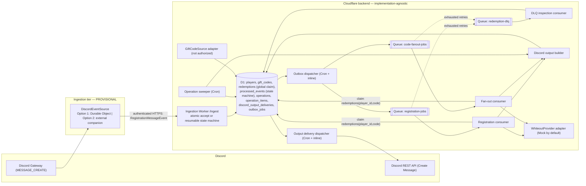

# Architecture — Whiteout Survival Rewards Service

- **Status:** Draft
- **Date:** 2026-08-30
- **Owner:** wos-rewards-service maintainers
- **Supersedes:** none
- **Related:** [ADR 0001 — Discord event ingestion](adr/0001-discord-event-ingestion.md) (**Proposed**), [Whiteout provider decision](whiteout-provider-decision.md)

> Evidence in this document is tagged **[fact:<ref>]** (confirmed by an official
> documentation page listed in [§25](#25-official-sources)), **[inference]** (a design
> conclusion drawn from those facts), or **[assumption]** (needs a spike or human decision).

---

## 1. Scope, goals, non-goals

### In scope

- A Discord bot that registers Whiteout Survival players from plain messages in **one
  configured registration channel** and processes gift codes for them.
- Cloudflare Workers + Durable Objects + D1 + Queues as the backend runtime, TypeScript
  strict mode, staging-first.
- `MockWhiteoutProvider` as the default gift-code redemption provider in development,
  automated tests, and staging.
- A stable ingestion boundary (`DiscordEventSource`) so the rest of the system does not
  depend on how the Discord Gateway connection is hosted.

### Goals

- Idempotent handling of every Discord event, player registration, gift code, and
  redemption attempt.
- **Atomic acceptance:** a Discord event is never marked accepted without either its
  registration work or its validation response also becoming durable in the same unit (or
  remaining resumable through an explicit state machine).
- **Global redemption serialization:** at most one `WhiteoutProvider.redeem` call is
  in flight per `(player_id, code)` pair, regardless of how many operations reference it.
- **One logical summary per operation with at-least-once Discord delivery and bounded
  duplicate suppression.** Every user-facing Discord message (operation summary or
  invalid-input reply) is built deterministically, persisted per chunk, and delivered
  through the same durable mechanism; duplicates remain possible outside Discord's
  few-minute nonce window **[fact:D6]**.
- Clear staging/production separation with no shared secrets, databases, or queues.
- No dependency on undocumented Whiteout Survival endpoints, scraping, cookies, session
  credentials, CAPTCHA bypass, or anti-bot bypass.

### Non-goals

- Production gift-code redemption (blocked — see
  [whiteout-provider-decision.md](whiteout-provider-decision.md)).
- A finalized gift-code discovery source (represented as an abstraction only).
- Discord self-bot behaviour or automation of a normal Discord user account.
- Slash-command / interactions UX as the primary registration path (evaluated only as ADR
  0001 Option 3 / fallback).
- Multi-guild scale-out, a web dashboard, analytics, or historical reporting.
- Choosing where a non-Cloudflare companion process runs (infra decision, deferred).

---

## 2. System context and deployment topology

> **PROVISIONAL — pending [ADR 0001](adr/0001-discord-event-ingestion.md) spike.**
> The ingestion tier below shows **Option 2 (external companion Gateway client)** as the
> provisional reference topology because official platform documentation does **not**
> establish a reliability guarantee for a permanently hosted Cloudflare Gateway client
> **[fact:C1][fact:C2]**. ADR 0001 is **Proposed**; a time-boxed spike decides between
> Option 1 (Durable Object Gateway client) and Option 2. Everything to the right of the
> `DiscordEventSource` boundary is identical for either outcome.



### Deployment stacks

Two fully separate stacks, `staging` and `production`, selected by the `ENVIRONMENT`
variable. Each stack has its own D1 database, its own three Queues, its own Durable Object
namespace (if Option 1 is chosen), its own Discord application + bot token, its own Cron
Triggers, and its own secret set. No resource, name, or secret is shared between stacks.
See [§19](#19-staging-and-production-separation).

### Trust boundaries

- **Discord ↔ ingestion tier:** the Discord bot token authenticates the Gateway
  connection. Only `MESSAGE_CREATE` events for the configured guild + registration channel,
  authored by a **non-bot, non-system, non-webhook** user, are relevant
  ([§5](#5-discord-registration-flow)).
- **Ingestion tier ↔ Cloudflare backend:** the ingestion tier authenticates to the
  Ingestion Worker with `INGESTION_SHARED_SECRET` (Option 2) or is in-process (Option 1).
  The ingestion tier is **untrusted for business logic** — it may not decide whether a
  registration is valid.
- **Cloudflare backend ↔ Whiteout Survival:** all access goes through the
  `WhiteoutProvider` interface, serialized per `(player_id, code)` by the global
  `redemptions` record. No other component talks to the game.

---

## 3. `DiscordEventSource` — the ingestion boundary

`DiscordEventSource` is the single seam the rest of the system depends on. It delivers one
message shape to the Ingestion Worker and nothing else:

```ts
// The only payload the Cloudflare backend consumes from the ingestion tier.
interface RegistrationMessageEvent {
  event_id: string;          // Discord message id, canonical string (never a number)
  guild_id: string;          // canonical string
  channel_id: string;        // canonical string
  author_id: string;         // canonical string (message.author.id)
  author_is_bot: boolean;    // message.author.bot === true
  author_is_system: boolean; // message.author.system === true
  webhook_id: string | null; // message.webhook_id (non-null => webhook-authored)
  application_id: string | null; // message.application_id
  content: string;           // RAW message content, forwarded even when syntactically invalid
  created_at: string;        // ISO-8601 timestamp from the Discord message
}

interface DiscordEventSource {
  // Implementations hold the Discord Gateway connection, filter to the configured
  // guild + registration channel, drop bot / system / webhook / own-application messages,
  // and POST RegistrationMessageEvent to the Ingestion Worker. They perform NO
  // player-registration business validation.
}
```

### Author filtering (production)

Production registration ingestion **ignores**:

- the application's own messages (`author_id` equals the app's bot user id, or
  `application_id` equals `DISCORD_APPLICATION_ID`);
- any message where `author_is_bot` is true;
- any message where `author_is_system` is true;
- any message where `webhook_id` is non-null (webhook-authored).

The ingestion tier applies this filter **before creating a `RegistrationMessageEvent`**.
The Ingestion Worker re-applies the identical filter as defense in depth using the
`author_is_bot` / `author_is_system` / `webhook_id` / `application_id` fields
**[fact:D2][fact:D7]**.

**Staging-only spike exception:** in the `staging` stack only, the Ingestion Worker may
honour `SPIKE_SENDER_ALLOWLIST` — a list of dedicated spike **bot / webhook** sender ids
that bypass the bot/webhook filter. The Worker asserts `ENVIRONMENT !== "production"`
before consulting the list; the variable is never defined in the production stack, and the
allow-list can only ever admit a dedicated bot account or incoming webhook, never a normal
user. See [ADR 0001 §6](adr/0001-discord-event-ingestion.md#6-decision-proposed-spike-gated).

### Candidate implementations (decided by [ADR 0001](adr/0001-discord-event-ingestion.md))

| | `DurableObjectGatewaySource` (Option 1) | `CompanionGatewaySource` (Option 2, provisional) |
|---|---|---|
| Host | A Durable Object holds the outbound Gateway WebSocket | A minimal always-on process outside Cloudflare |
| Reliability basis | **Not guaranteed by docs** — outbound WebSockets do not hibernate and an active outbound connection only *prevents eviction for up to 15 minutes per connection* **[fact:C2]**; normal lifecycle/eviction timing resumes afterward **[fact:C1]** | A normal long-lived process; standard supervised-restart operations |
| Secrets it holds | Discord bot token (Worker secret) | Discord bot token + `INGESTION_SHARED_SECRET` |
| Decision | The ADR 0001 spike tests whether Option 1 is reliable enough; if it passes, Option 1 is preferred (fewer moving parts) | Provisional reference until the spike completes or is explicitly waived |

**Blocking rule:** the real `DiscordEventSource` adapter (either implementation) is **not
built** until the ADR 0001 spike completes or is explicitly waived. Phases 1–4
([§23](#23-phased-implementation-order)) build everything to the right of this boundary
against `RegistrationMessageEvent` alone.

### Companion validation scope (Option 2)

The companion validates **only**: transport schema of its own forward request, its auth
context (`INGESTION_SHARED_SECRET`), `guild_id`, `channel_id` (must equal
`DISCORD_REGISTRATION_CHANNEL_ID`), and the author gate above (drop bot / system / webhook /
own-application messages). It **forwards `content` verbatim even when the registration
syntax is invalid**, because the Cloudflare business layer must generate the Discord
validation reply **[inference]**. It has no D1 access and never writes to Discord.

---

## 4. Configuration and environment

Variable **names only** — no values appear in this repository. Values are supplied per
stack via Wrangler vars (non-secret) and Wrangler secrets (secret).

### Non-secret configuration

| Name | Read by | Purpose |
|---|---|---|
| `ENVIRONMENT` | all | `staging` or `production`; selects the stack |
| `DISCORD_REGISTRATION_CHANNEL_ID` | ingestion tier, ingestion Worker | the only channel whose messages are registration commands |
| `DISCORD_GUILD_ID` | ingestion tier, ingestion Worker | expected guild |
| `DISCORD_APPLICATION_ID` | ingestion Worker, output builder | own application id; used by the author filter |
| `DEFAULT_STATE` | registration parser | state used when the message omits a numeric state (contract in `AGENTS.md`) |
| `DISCORD_MESSAGE_MAX_LENGTH` | output builder | chunking threshold (defaults to the Discord limit) |
| `OPERATION_DEADLINE_SECONDS` | consumers, sweeper | max wall time before an operation is force-closed with a partial summary |
| `ITEM_CLAIM_LEASE_SECONDS` | consumers, sweeper | `operation_items` lease TTL |
| `REDEMPTION_CLAIM_LEASE_SECONDS` | consumers, sweeper | global `redemptions` claim lease TTL |
| `OUTPUT_CLAIM_LEASE_SECONDS` | output dispatcher, sweeper | `discord_output_deliveries` claim lease TTL |
| `FANOUT_EXPANSION_PAGE_SIZE` | fan-out expansion worker | rows per bounded expansion page |
| `OUTBOX_DISPATCH_MAX_ATTEMPTS` | outbox dispatcher | attempts before an outbox row is marked `dead` |
| `OUTPUT_DISPATCH_MAX_ATTEMPTS` | output dispatcher | send attempts before a delivery row is alerted |
| `CODE_DISCOVERY_ENABLED` | code-discovery scheduler | master switch; `false` until a source is authorized |
| `PRODUCTION_REDEMPTION_ENABLED` | provider adapter | must be `false` unless an authorized provider is documented and approved |
| `PROVIDER_MODE` | provider adapter | `mock` (default) or a named authorized provider |
| `REGISTRATION_JOBS_QUEUE` / `CODE_FANOUT_JOBS_QUEUE` / `REDEMPTION_DLQ_QUEUE` | producers/consumers | queue bindings |
| `PROVIDER_MAX_RETRIES` | consumers | retry cap for retryable provider failures (≤ Queues max, [fact:C8]) |
| `PROVIDER_RATE_LIMIT_PER_SECOND` | provider adapter | client-side rate limiting toward the provider |
| `SPIKE_SENDER_ALLOWLIST` | ingestion Worker (**staging only**) | dedicated spike bot/webhook sender ids allowed past the bot/webhook filter; never set in production |
| `LOG_LEVEL` | all | structured-log verbosity |

### Secrets (names only — never values, never logged)

| Name | Held by | Purpose |
|---|---|---|
| `DISCORD_BOT_TOKEN` | ingestion tier, output dispatcher | Discord bot authentication |
| `DISCORD_PUBLIC_KEY` | interactions fallback only | Ed25519 verification for the `/register` fallback ([ADR 0001](adr/0001-discord-event-ingestion.md) Option 3) |
| `INGESTION_SHARED_SECRET` | companion (Option 2), ingestion Worker | authenticates companion → `/ingest` |

**No production Whiteout provider secret is defined.** A future authorized provider may use
any authentication mechanism; its secret name(s) are added only when its contract is
documented and approved. Any `WHITEOUT_PROVIDER_*` name that appears later is a non-binding
placeholder, not a commitment to API-key authentication.

---

## 5. Discord registration flow

### Channel and author gate

A message is a candidate registration command only if it is in
`DISCORD_REGISTRATION_CHANNEL_ID` within `DISCORD_GUILD_ID` **[fact:D2][fact:D3]** **and**
passes the author filter in [§3](#author-filtering-production) (not a bot, system, webhook,
or the app itself) **[fact:D7]**. Everything else is dropped before an event is created.

### Parsing (authoritative rules from `AGENTS.md`)

Supported message forms:

- `PLAYER_ID`
- `PLAYER_ID DISPLAY_NAME`
- `PLAYER_ID STATE`
- `PLAYER_ID STATE DISPLAY_NAME`

Behaviour:

- `PLAYER_ID` is required and must be numeric (validated as `^\d+$`). It is **stored and
  transported as a canonical string** — see [§10](#10-identifier-handling).
- If the second token is numeric, it is `STATE` (also kept as a string).
- If the second token is not numeric, `STATE` is `DEFAULT_STATE` (from environment
  configuration, never hard-coded) and the second and all remaining tokens are
  `DISPLAY_NAME`.
- `DISPLAY_NAME` is optional and may contain spaces.
- If no display name is supplied, Discord output uses `ID <PLAYER_ID>`.
- Re-registering an existing player updates the existing row (upsert), never creates a
  duplicate.
- Display names are sanitized and mentions suppressed on output
  ([§18](#18-discord-output-safety)).
- The bot never infers state or nickname from any Whiteout Survival endpoint. The `STATE`
  carried forward to the provider is exactly the one from this contract.

### Atomic acceptance

The Ingestion Worker never writes a bare "processed" marker before the work. It builds the
**entire write set** for the event and commits it as **one atomic D1 `db.batch()`**
**[fact:C9]** whose first statement is a plain `INSERT INTO processed_events (event_id, …)`.
A primary-key conflict rolls the whole batch back atomically and is interpreted as a
**duplicate delivery** → ack, no-op.

- **Invalid input** — the atomic unit persists, together:
  1. `processed_events` row with `status = 'accepted_invalid'` and `validation_reason`;
  2. the `discord_output_deliveries` row for the validation reply (single chunk,
     deterministic ≤ 25-char nonce, `status = 'pending'`, **no footer**).
- **Valid input** — the atomic unit persists, together:
  1. `processed_events` row with `status = 'accepted_valid'` and `operation_id`;
  2. the `players` upsert;
  3. the `operations` row (`type = 'registration_run'`) with `expected_count` fixed at the
     active-code snapshot size;
  4. one `operation_items` row per snapshotted active code;
  5. one per-item `outbox_jobs` row.

A registration write set is bounded by the number of currently-active gift codes, which is
small in practice. **If that count ever exceeds a safe single-batch size**, acceptance
falls back to the **explicit state machine**: the atomic unit commits only
`processed_events (status = 'accepted_valid')` + the `operations` shell
(`expansion_state = 'pending'`), and a paginated expansion
([§7](#7-new-code-fan-out-flow)) fills `operation_items` + `outbox_jobs`.
`processed_events.status` advances to `work_committed` only when
`expansion_state = 'expanded'`. The sweeper re-drives any event stuck in `accepted_valid`.
**A crash can never leave an event `accepted_*` without either its registration work or its
validation-reply delivery row durably present**, because the marker is only ever written in
the same batch as one of them.

### Invalid message reply

The validation reply is delivered by the **output delivery dispatcher**
([§15.4](#154-deterministic-summary-build-and-durable-per-chunk-delivery)) from its
persisted `discord_output_deliveries` row — the same durable mechanism as summaries. It is
mention-suppressed, describes the accepted forms, and **carries no runtime footer**. A
retry resumes the unsent delivery rather than re-posting, with bounded Discord-side
duplicate suppression **[fact:D6]**.

### Valid message — sequence

```mermaid
sequenceDiagram
  participant U as User (registration channel)
  participant S as DiscordEventSource
  participant I as Ingestion Worker
  participant DB as D1
  participant X as Outbox dispatcher
  participant Q as registration-jobs
  participant C as Registration consumer
  participant R as redemptions (global claim)
  participant P as WhiteoutProvider (Mock)
  participant OD as Output delivery dispatcher

  U->>S: message "PLAYER_ID [STATE] [NAME]"
  S->>I: POST /ingest RegistrationMessageEvent (auth, author-filtered)
  I->>DB: ONE atomic batch — INSERT processed_events(accepted_valid), upsert players, insert operations, operation_items, outbox_jobs
  Note over DB: PK conflict on processed_events => whole batch rolls back => duplicate, no-op
  I->>X: best-effort enqueue
  X->>Q: one registration job per code
  loop each code
    Q->>C: job {operation_id, item_key=code, job_id}
    C->>DB: claim operation_items lease (queue-dedup + accounting)
    C->>R: upsert-and-claim redemptions(player_id, code)
    alt redemption already terminal
      R-->>C: terminal outcome (success | already_redeemed | permanent_failure | retry_exhausted)
      C->>DB: mirror outcome onto operation_items
    else claim won
      C->>P: redeem(PlayerRef{playerId,state}, code, idempotency_key)
      P-->>C: success | already_redeemed | retryable | permanent
      C->>DB: write redemptions terminal row WHERE claim_token matches; mirror onto operation_items
    else claim held elsewhere (live lease)
      C->>Q: message.retry(short delay) — then re-resolve from terminal row
    end
  end
  C->>DB: all items terminal? build ALL summary chunks deterministically; persist discord_output_deliveries rows
  OD->>DB: claim next pending delivery chunk (in order)
  OD->>U: Create Message (per-chunk deterministic nonce, enforce_nonce); footer only in final chunk
  OD->>DB: record discord_message_id, sent_at WHERE claim_token matches
```

A zero-active-code snapshot yields `expected_count = 0`; the operation is immediately
finalisable and produces a **single-chunk** zero-result summary
(`"0 codes applied"`) whose one chunk carries the runtime footer.

---

## 6. Existing-code processing after registration

1. **Atomic acceptance** ([§5](#atomic-acceptance)) has already committed the `players`
   upsert, the `registration_run` operation, its `operation_items`, and their `outbox_jobs`
   in one unit (or via the resumable state machine).
2. **Dispatch** (`registration-jobs`) — inline best-effort plus the Cron dispatcher
   ([§14](#14-transactional-outbox)).
3. **Consume:** each job carries `{operation_id, item_key: code, job_id}`. The consumer:
   - claims the `operation_items` lease ([§15.1](#151-operation-item-lease-queue-dedup--accounting));
   - **claims the global `redemptions` record** for `(player_id, code)`
     ([§15.2](#152-global-redemption-record--the-sole-provider-call-authority)); if it is
     already terminal it reuses that outcome without calling the provider; if the claim is
     held by a live lease elsewhere it defers via `message.retry`;
   - on a won claim, calls
     `WhiteoutProvider.redeem({ playerId, state }, code, idempotencyKey)`, honouring
     `PROVIDER_RATE_LIMIT_PER_SECOND`, retrying only `retryable` outcomes
     ([§17](#17-retry-and-permanent-failure-classification));
   - writes the `redemptions` terminal row conditional on its claim token, then mirrors the
     outcome onto its `operation_items` row.
4. **Aggregate & summarize:** when every item is terminal
   ([§15.3](#153-completion-accounting)), the operation's summary is built deterministically
   and delivered per chunk ([§15.4](#154-deterministic-summary-build-and-durable-per-chunk-delivery)):
   how many codes were applied (`success` + `already_redeemed`) and which, identifying the
   player by display name or `ID <PLAYER_ID>`. The runtime footer from `AGENTS.md` appears
   **only in the final persisted chunk**.

---

## 7. New-code fan-out flow

1. **Discover** a candidate code via `GiftCodeSource`
   ([§9](#9-scheduled-cron-components-and-the-trigger-budget),
   [§11](#11-whiteoutprovider-and-giftcodesource-abstractions)). The source is **not
   authorized** yet; the flow is defined so it works the moment an authorized source exists.
2. **Deduplicate** on `gift_codes.code` (unique). A re-seen code is a no-op.
3. **Open a `code_distribution_run` operation** and fix a **stable player snapshot
   boundary** at discovery time (a monotonic `player_id` cursor filtered by `snapshot_at`,
   or an `operation_players_snapshot` side table). `expected_count` = boundary size.
4. **Bounded, restartable expansion:** the fan-out expansion worker repeatedly reads the
   next `FANOUT_EXPANSION_PAGE_SIZE` players after `expansion_cursor` and, in one atomic D1
   batch, writes that page's `operation_items` rows + per-item `outbox_jobs` rows + the
   advanced `expansion_cursor`. `expansion_state` moves `pending → expanding → expanded`.
   After a crash it resumes from the persisted cursor; already-written pages are skipped by
   primary-key conflict.
5. **Consume** (`code-fanout-jobs`): claim the `operation_items` lease, then **claim the
   global `redemptions` record** for `(player_id, code)` exactly as in
   [§6](#6-existing-code-processing-after-registration) — join/reuse a terminal outcome,
   defer on a live lease, or call the provider on a won claim.
6. **Aggregate & summarize:** when `expansion_state = expanded` **and** all items are
   terminal, the operation's summary is built deterministically and delivered per chunk: the
   code, the applied-player count (`success` + `already_redeemed`), and a comma-separated
   list of display names / `ID <PLAYER_ID>` fallbacks. Output is **chunked** when it exceeds
   `DISCORD_MESSAGE_MAX_LENGTH` ([§18](#18-discord-output-safety)); the runtime footer
   appears **only in the final persisted chunk**. Zero registered players ⇒ single-chunk
   zero-result summary.

### Overlap is handled by the global redemption record

A `registration_run` snapshots the codes active at registration time; a
`code_distribution_run` snapshots the players registered at discovery time. These can still
**overlap for the same `(player_id, code)`** (e.g. a race between a registration and a
just-discovered code). The `redemptions` record for `(player_id, code)` is the **single
provider-call authority** ([§15.2](#152-global-redemption-record--the-sole-provider-call-authority)):
whichever consumer claims it first calls the provider; every other operation item for the
same pair joins or reuses that terminal outcome and never calls the provider
independently **[inference]**.

---

## 8. Component responsibilities

| Component | Responsibility | Notes |
|---|---|---|
| `DiscordEventSource` | Hold the Gateway connection; filter to guild+channel; drop bot/system/webhook/own-app messages; POST `RegistrationMessageEvent` | Companion **or** DO, per ADR 0001; no business logic |
| Ingestion Worker (`/ingest`) | Authenticate the source; re-apply the author filter; parse; **atomically** persist `processed_events` + (validation-reply delivery row **or** registration work + outbox rows), or the resumable state-machine shell | Stateless Worker; PK conflict ⇒ duplicate no-op |
| Fan-out expansion worker | Paginate the player snapshot into `operation_items` + outbox rows | Cursor-driven, bounded, restartable |
| Outbox dispatcher | Enqueue `pending` outbox rows; back off; mark `dead`; **atomic-reopen** pre-summary or flag a repair after finalization ([§14](#14-transactional-outbox)) | Cron (every minute, [fact:C4]) + inline best-effort |
| Registration consumer | Claim item lease; **claim global redemption**; redeem or reuse; mirror outcome; trigger summary build | Queue consumer |
| Fan-out consumer | Claim item lease; **claim global redemption**; redeem or reuse; mirror outcome; trigger summary build when expansion done | Queue consumer |
| DLQ inspection consumer | Mark the `redemptions` row and mirrored `operation_items` `retry_exhausted`; record reason | Consumer of `redemption-dlq` |
| Operation sweeper | Force-close operations past `OPERATION_DEADLINE_SECONDS`; reset expired item / redemption / output-delivery leases; mirror terminal redemptions onto waiting items; atomic-reopen outbox-dead items pre-summary | Cron |
| Discord output builder | Build summaries / validation replies deterministically; sanitize; suppress mentions; split into chunks; persist `discord_output_deliveries` rows | Called by consumers / sweeper |
| Output delivery dispatcher | Claim `pending` (or lease-expired) `discord_output_deliveries` chunks in order; send via Create Message with per-chunk nonce + `enforce_nonce`; record `discord_message_id`; resume at the first unsent chunk | Cron (every minute) + inline best-effort |
| `WhiteoutProvider` adapter | `redeem(PlayerRef, code, idempotencyKey)` → structured result; provider-side rate limiting; error mapping | `MockWhiteoutProvider` by default |
| `GiftCodeSource` adapter | Discover/list candidate codes from an **authorized** source | Not authorized; disabled |
| Code-discovery scheduler | Poll the authorized source when `CODE_DISCOVERY_ENABLED=true` | Cron; no-op until authorized |
| D1 | System of record | See [§12](#12-preliminary-d1-data-model) |
| Queues + DLQ | Async fan-out + retry isolation | See [§13](#13-cloudflare-queue-and-dead-letter-queue-boundaries) |

---

## 9. Scheduled (Cron) components and the trigger budget

Cloudflare allows **5 Cron Triggers per account on Free, 250 on Paid** **[fact:C5]**, and
minimum granularity is one minute **[fact:C4]**. The design keeps the scheduled surface
small and, where practical, multiplexes work into a single `scheduled()` handler that
dispatches by current UTC minute.

| Scheduled job | Cadence | Work |
|---|---|---|
| Outbox dispatcher | every minute | enqueue `pending` `outbox_jobs`; back off; mark `dead`; atomic-reopen pre-summary or flag a repair after finalization ([§14](#14-transactional-outbox)) |
| Output delivery dispatcher | every minute | claim and send `pending` / lease-expired `discord_output_deliveries` chunks in `chunk_index` order; resume at the first unsent chunk ([§15.4](#154-deterministic-summary-build-and-durable-per-chunk-delivery)) |
| Operation sweeper | every minute | force-close operations past `deadline_at` with a partial summary; reset expired item / redemption / output-delivery leases; mirror terminal `redemptions` onto waiting `operation_items` |
| Retention | hourly | delete fully-accounted `enqueued` outbox rows and `sent` delivery rows past the retention window |
| Code-discovery scheduler | configurable | poll the authorized `GiftCodeSource` when `CODE_DISCOVERY_ENABLED=true`; **no-op until a source is authorized** |

Durable Object **alarms** ([fact:C3]) are an implementation option for per-operation timers
if Option 1 is chosen or if per-operation precision is needed; they do not consume the Cron
Trigger budget.

---

## 10. Identifier handling

- **`PLAYER_ID`** is validated on input as `^\d+$`, then **stored and transported only as a
  canonical string**: D1 column type `TEXT`, TypeScript type `string`, JSON string in every
  queue payload and interface. It is **never** parsed to a JavaScript `number` and **never**
  stored in a SQLite `INTEGER` column, because large numeric ids lose precision beyond
  2^53 and integer affinity would normalise away leading zeros **[fact:C9]**.
- **`STATE`** is digit-only input but is likewise kept as `TEXT` / `string`; no arithmetic
  is performed on it. It is carried unchanged into `PlayerRef.state`
  ([§11](#11-whiteoutprovider-and-giftcodesource-abstractions)).
- **Canonicalisation rule (to finalise in implementation):** trim surrounding whitespace;
  reject empty; preserve the remaining digit string verbatim.
- Every key, foreign key, queue payload field, `operation_items.item_key`, redemption
  `idempotency_key`, and idempotency check in this document uses string identifiers.

---

## 11. `WhiteoutProvider` and `GiftCodeSource` abstractions

The two concerns are **separate interfaces**. Discovery never lives on `WhiteoutProvider`.

```ts
// State comes from the registration contract (user input or DEFAULT_STATE).
// The provider MUST NOT look up or infer state or nickname.
interface PlayerRef {
  playerId: string;
  state: string;
}

type RedeemResult =
  | { outcome: 'success'; providerReceipt?: string }          // terminal, counts as applied
  | { outcome: 'already_redeemed'; providerReceipt?: string } // terminal, success-equivalent, counts as applied
  | { outcome: 'retryable'; reasonCode: string }              // 429 / 5xx / network / provider "rate limited"
  | { outcome: 'permanent'; reasonCode: string };             // invalid code, expired code, ineligible player

interface WhiteoutProvider {
  // Apply ONE gift code to ONE player. `idempotencyKey` is the stable per-(player,code)
  // key from the global redemptions record; a compliant real provider uses it (or an
  // authorized reconciliation lookup) so a retried redemption is a safe no-op.
  redeem(player: PlayerRef, code: string, idempotencyKey: string): Promise<RedeemResult>;
}

interface DiscoveredCode {
  code: string;
  source: string;        // identifier of the authorized source
  discoveredAt: string;  // ISO-8601
}

interface GiftCodeSource {
  // Discover/list candidate gift codes from a SEPARATELY AUTHORIZED source.
  // Status: NOT AUTHORIZED. No scraping, no undocumented game endpoint.
  listCandidateCodes(): Promise<DiscoveredCode[]>;
}
```

- The **registration consumer reads active codes from D1** (`gift_codes` where
  `status='active'`), never from `WhiteoutProvider`.
- `MockWhiteoutProvider` is the default in development, automated tests, and staging. It
  accepts the `PlayerRef` + `idempotencyKey` signature, produces deterministic, configurable
  outcomes (`success`, `already_redeemed`, `retryable` for simulated rate limits and 5xx,
  `permanent` for invalid/expired codes), and is idempotent by construction — the same
  `idempotencyKey` never applies a code twice.
- `already_redeemed` is a **success-equivalent terminal outcome**, not a failure. It counts
  toward "codes applied" / "players" in operation totals and user-facing summaries; a
  summary may render a parenthetical note but never lists it as a failure
  ([§15.3](#153-completion-accounting), [§17](#17-retry-and-permanent-failure-classification)).
- Error mapping is a table owned by the adapter (provider signal → outcome + `reasonCode`);
  see [whiteout-provider-decision.md §6](whiteout-provider-decision.md#6-provider-rate-limits-and-error-mapping).
- All Whiteout Survival access goes through `WhiteoutProvider`, serialized per
  `(player_id, code)` by the global `redemptions` record. Real redemption stays disabled
  until an authorized provider and its API contract are documented and approved.

---

## 12. Preliminary D1 data model

> **Preliminary — no migrations are authored in this task.** Column lists below are a
> design sketch for later implementation. All identifier columns are `TEXT`
> ([§10](#10-identifier-handling)).

### `players`

| Column | Type | Notes |
|---|---|---|
| `player_id` | TEXT PK | canonical digit string |
| `state` | TEXT | digit string; from input or `DEFAULT_STATE` |
| `display_name` | TEXT NULL | rendered as `ID <player_id>` when null |
| `created_at`, `updated_at` | TEXT | ISO-8601 |

Re-registration = upsert on `player_id`.

### `gift_codes`

| Column | Type | Notes |
|---|---|---|
| `code` | TEXT PK | dedupe key |
| `status` | TEXT | `active` / `expired` / `disabled` |
| `discovered_at` | TEXT | |
| `source` | TEXT | authorized-source identifier |
| `first_seen_event_id` | TEXT NULL | provenance |

### `processed_events` (event-acceptance state machine)

| Column | Type | Notes |
|---|---|---|
| `event_id` | TEXT PK | Discord message id; the atomic marker |
| `kind` | TEXT | `registration` |
| `status` | TEXT | `accepted_invalid` / `accepted_valid` / `work_committed` / `finalized` |
| `outcome` | TEXT NULL | `invalid` / `valid` |
| `operation_id` | TEXT NULL | set in the same atomic unit when `accepted_valid` |
| `validation_reason` | TEXT NULL | set in the same atomic unit when `accepted_invalid` |
| `output_delivery_group` | TEXT | groups `discord_output_deliveries` rows for this event's validation reply (invalid) |
| `received_at`, `accepted_at`, `committed_at`, `finalized_at` | TEXT NULL | lifecycle timestamps |

The row is **only ever inserted in the same `db.batch()`** as the validation-reply delivery
row (invalid) or the registration work + outbox rows (valid). No earlier bare insert
exists. A PK conflict on insert ⇒ duplicate delivery ⇒ the whole batch rolls back ⇒ ack,
no-op. In state-machine mode, `status` stays non-terminal (`accepted_valid`) until
`work_committed`; the sweeper re-drives anything stuck.

### `redemptions` (global provider-call authority)

| Column | Type | Notes |
|---|---|---|
| `player_id` | TEXT | PK part |
| `code` | TEXT | PK part |
| `idempotency_key` | TEXT | deterministic, stable per pair — e.g. `redeem:v1:<player_id>:<code>`; passed to `WhiteoutProvider.redeem` |
| `status` | TEXT | `pending` / `in_progress` / `success` / `already_redeemed` / `permanent_failure` / `retry_exhausted` |
| `claim_token` | TEXT NULL | current claimant |
| `claim_expires_at` | TEXT NULL | lease expiry (`REDEMPTION_CLAIM_LEASE_SECONDS`) |
| `attempts` | INTEGER | provider call attempts |
| `provider_receipt` | TEXT NULL | optional reconciliation reference from a real provider |
| `reason_code` | TEXT NULL | for `permanent_failure` / `retry_exhausted` |
| `first_claimed_at`, `terminal_at`, `updated_at` | TEXT NULL | |

PK `(player_id, code)`. This row — **not** `operation_items` — is the sole authority for
whether `WhiteoutProvider.redeem` may be called for the pair.

### `operations`

| Column | Type | Notes |
|---|---|---|
| `operation_id` | TEXT PK | ULID/UUID |
| `type` | TEXT | `registration_run` / `code_distribution_run` / `repair_run` |
| `trigger_kind` | TEXT | `discord_event` / `discovered_code` / `human_repair` |
| `trigger_ref` | TEXT | event id, `code`, or origin `operation_id` |
| `snapshot_at` | TEXT | boundary timestamp |
| `expected_count` | INTEGER | fixed at snapshot; `0` allowed |
| `expansion_state` | TEXT | `pending` / `expanding` / `expanded` |
| `expansion_cursor` | TEXT NULL | last `player_id` expanded, fixed sort order |
| `state` | TEXT | `pending` / `in_progress` / `awaiting_summary` / `summarized` / `stale_closed` |
| `deadline_at` | TEXT | `snapshot_at + OPERATION_DEADLINE_SECONDS` |
| `summary_state` | TEXT | `none` / `built` / `delivered` (real per-chunk state lives in `discord_output_deliveries`) |
| `summary_delivery_group` | TEXT NULL | groups this operation's summary chunk rows |
| `success_count` / `already_redeemed_count` / `permanent_failure_count` / `retry_exhausted_count` / `completed_count` | INTEGER NULL | **cache only**, recomputed from `operation_items` at build time |
| `created_at`, `updated_at` | TEXT | |

### `operation_items`

| Column | Type | Notes |
|---|---|---|
| `operation_id` | TEXT | PK part |
| `item_key` | TEXT | PK part — `code` (registration) or `player_id` (distribution) |
| `player_id` | TEXT | resolved pair member |
| `code` | TEXT | resolved pair member |
| `job_id` | TEXT | `registration:<operation_id>:<code>` / `distribution:<operation_id>:<player_id>` |
| `status` | TEXT | `pending` / `in_progress` / `success` / `already_redeemed` / `permanent_failure` / `retry_exhausted` (mirrors the global `redemptions` outcome) |
| `claim_token` | TEXT NULL | lease token (queue-dedup + accounting only) |
| `claim_expires_at` | TEXT NULL | lease expiry (`ITEM_CLAIM_LEASE_SECONDS`) |
| `reason_code` | TEXT NULL | |
| `attempts` | INTEGER | |
| `updated_at` | TEXT | |

PK `(operation_id, item_key)`. The item lease dedupes queue redeliveries and drives
completion accounting; it does **not** authorize a provider call.

### `operation_players_snapshot` (distribution runs only; optional)

| Column | Type | Notes |
|---|---|---|
| `operation_id` | TEXT | PK part |
| `player_id` | TEXT | PK part |

Point-in-time player boundary when a monotonic cursor filter is not used.

### `discord_output_deliveries` (durable per-message output)

| Column | Type | Notes |
|---|---|---|
| `delivery_id` | TEXT PK | deterministic — e.g. `out:<group>:<chunk_index>` |
| `delivery_group` | TEXT | `output_delivery_group` (event) or `summary_delivery_group` (operation) |
| `event_id` | TEXT NULL | set for validation replies |
| `operation_id` | TEXT NULL | set for operation summaries |
| `channel_id` | TEXT | target channel |
| `output_type` | TEXT | `validation_reply` / `registration_summary` / `distribution_summary` / `partial_summary` |
| `chunk_index` | INTEGER | 1-based |
| `chunk_total` | INTEGER | total chunks in this logical message |
| `content` | TEXT | immutable rendered chunk text (or store `content_hash` and rebuild deterministically) |
| `content_hash` | TEXT | hash of `content` for tamper/consistency checks |
| `has_footer` | INTEGER | 1 only when `chunk_index = chunk_total` **and** `output_type` ≠ `validation_reply` |
| `nonce` | TEXT | deterministic, **≤ 25 chars**, derived by hashing `delivery_id` **[fact:D6]** |
| `status` | TEXT | `pending` / `claimed` / `sent` / `superseded` |
| `claim_token` | TEXT NULL | current claimant |
| `claim_expires_at` | TEXT NULL | lease expiry (`OUTPUT_CLAIM_LEASE_SECONDS`) |
| `attempts` | INTEGER | send attempts |
| `discord_message_id` | TEXT NULL | recorded after Create Message |
| `sent_at`, `created_at`, `updated_at` | TEXT NULL | |

All chunks of a logical message are built and persisted **before any are sent**. The
dispatcher sends them in `chunk_index` order and resumes at the first non-`sent` row.

### `outbox_jobs`

| Column | Type | Notes |
|---|---|---|
| `job_id` | TEXT PK | per-item deterministic id (see `operation_items.job_id`) |
| `operation_id` | TEXT | |
| `item_key` | TEXT | |
| `type` | TEXT | `registration` / `distribution` |
| `payload_json` | TEXT | the queue message body |
| `status` | TEXT | `pending` / `enqueued` / `dead` |
| `attempts` | INTEGER | |
| `available_at` | TEXT | backoff gate |
| `last_error` | TEXT NULL | |
| `created_at`, `updated_at` | TEXT | |

---

## 13. Cloudflare Queue and dead-letter-queue boundaries

- **Queues:** `registration-jobs`, `code-fanout-jobs`. One message per unit of work,
  carrying `{operation_id, item_key, job_id, player_id, code}` in the body. Cloudflare
  Queues exposes **no producer-side idempotency key** — deduplication is entirely
  consumer-side **[fact:C7]**. Delivery is at-least-once, so consumers must be safely
  re-runnable.
- **Batching / limits:** batch size ≤ 100 messages / 256 KB, batch wait ≤ 60 s, message
  ≤ 128 KB, `delaySeconds` ≤ 24 h, `max_retries` up to 100 **[fact:C8]**. Retry classified
  failures with `message.retry({ delaySeconds })` and backoff up to `PROVIDER_MAX_RETRIES`.
  A consumer also uses a short `message.retry` to **defer** when the global `redemptions`
  claim is held by a live lease elsewhere.
- **DLQ:** `redemption-dlq` receives a message only after its consumer exhausts
  `max_retries` **[fact:C6]**. Its inspection consumer marks the **`redemptions`** row and
  the mirrored `operation_items` row `retry_exhausted` with a reason, so the operation can
  still finalise. **Business-rule (`permanent`) failures never enter the DLQ** — they are
  recorded as terminal outcomes directly.
- Discord output delivery does **not** use a queue or DLQ: it is a Cron + inline dispatcher
  over `discord_output_deliveries` rows, with `attempts` and an alert after
  `OUTPUT_DISPATCH_MAX_ATTEMPTS`.

---

## 14. Transactional outbox

**Decision:** a per-item transactional outbox bridges the gap between a committed D1 intent
and a Queue enqueue. This design is **intended to prevent loss between the committed D1
intent and eventual Queue enqueue, subject to the documented platform guarantees and the
recovery process below** — it is not an absolute "no loss" claim.

- **Atomic write:** each page of domain rows is written together with its per-item
  `outbox_jobs` rows in a single `db.batch()` (atomic, all-or-nothing) **[fact:C9]** — the
  same unit as the `processed_events` marker for registration acceptance
  ([§5](#atomic-acceptance)). Large fan-out is written a bounded page at a time
  ([§7](#7-new-code-fan-out-flow)), never one unbounded batch.
- **Identity:** `job_id` is per unit of work
  (`registration:<operation_id>:<code>` / `distribution:<operation_id>:<player_id>`) and is
  carried in the queue message body alongside `operation_id`, `item_key`, `player_id`,
  `code`. The **consumer** uses it as the application-level dedup key (no producer key
  exists, [fact:C7]).
- **Dispatch:** (a) inline best-effort `queue.send()` immediately after a page commits,
  marking sent rows `enqueued`; (b) authoritative Cron dispatcher (every minute,
  [fact:C4]) scanning `status='pending' AND available_at <= now`, enqueuing, marking
  `enqueued`, and on failure setting `available_at` with exponential backoff and
  incrementing `attempts`. After `OUTBOX_DISPATCH_MAX_ATTEMPTS` the row is marked `dead` and
  an alert is raised.
- **`dead` handling — no ineffective requeue.** A `dead` outbox row means one unit of work
  never reached its queue. The dispatcher resolves it by one of two explicit paths,
  guarded on the operation's finalisation state:
  - **Atomic reopen (before the operation is summarized).** If
    `operations.summary_state = 'none'` **and**
    `operations.state NOT IN ('summarized','stale_closed')`, one `db.batch()` resets the
    `outbox_jobs` row to `pending` (`attempts = 0`, `available_at = now`) **and** the
    matching `operation_items` row to `pending` (`claim_token = NULL`). The guard makes the
    reset a no-op if the operation has moved on.
  - **Human-triggered repair (after finalization).** If the operation is already
    `summarized` / `stale_closed`, the dispatcher records the `operation_items` row as
    `retry_exhausted` (reason `outbox_dead`) so accounting is closed, raises an alert, and
    creates a `repair_run` operation stub (`type = 'repair_run'`, `trigger_ref` = origin
    `operation_id`) listing the affected `(player_id, code)` pairs. A human triggers the
    repair, which reuses the global `redemptions` records and produces its own summary. A
    finalized operation is **never** mutated in place.
- **Recovery:** on restart the dispatcher simply re-scans `pending`. The operation sweeper
  resets rows stuck in `enqueued` with no downstream progress past a threshold back to
  `pending`. A retention job deletes fully-accounted `enqueued` rows after a fixed period.

---

## 15. Redemption serialization, aggregation, and durable summary delivery

### 15.1 Operation-item lease (queue-dedup + accounting)

Each `operation_items` row carries a short lease so a redelivered or duplicated queue
message does not run the same item body twice, and so completion accounting is stable.

- **States:** `pending` → `in_progress` (`claim_token`, `claim_expires_at`) → `success` |
  `already_redeemed` | `permanent_failure` | `retry_exhausted`.
- **Atomic claim:**
  ```sql
  UPDATE operation_items
     SET status = 'in_progress', claim_token = :tok, claim_expires_at = :exp, updated_at = :now
   WHERE operation_id = :op AND item_key = :key
     AND (status = 'pending' OR (status = 'in_progress' AND claim_expires_at < :now));
  ```
  Proceed only if one row changed. A redelivery that finds the item terminal, or
  `in_progress` with a live lease, is acked as a no-op.
- The item lease **does not authorize a provider call** — that is §15.2. It only guards the
  local item body (claim global redemption, mirror the outcome).

### 15.2 Global redemption record — the sole provider-call authority

Before calling `WhiteoutProvider.redeem` for a `(player_id, code)` pair, a consumer **must
claim the global `redemptions` record** for that pair. This serializes redemption across
**all** operations (registration and distribution), which the per-operation item lease
cannot do on its own **[inference]**.

- **Deterministic key:** `idempotency_key = "redeem:v1:" + player_id + ":" + code`, stable
  for the life of the pair, stored on the row and passed to the provider.
- **Upsert-and-claim:**
  ```sql
  INSERT INTO redemptions (player_id, code, idempotency_key, status,
                           claim_token, claim_expires_at, attempts, first_claimed_at, updated_at)
       VALUES (:pid, :code, :idk, 'in_progress', :tok, :exp, 0, :now, :now)
  ON CONFLICT (player_id, code) DO UPDATE
       SET status = 'in_progress', claim_token = :tok, claim_expires_at = :exp, updated_at = :now
     WHERE redemptions.status = 'pending'
        OR (redemptions.status = 'in_progress' AND redemptions.claim_expires_at < :now);
  ```
- **Three outcomes:**
  1. **Terminal already** (`success` / `already_redeemed` / `permanent_failure` /
     `retry_exhausted`): the `ON CONFLICT` guard does not match; the consumer **does not
     call the provider**. It reads the terminal row and mirrors the outcome onto its
     `operation_items` row.
  2. **Claim won** (row now `in_progress` with this `claim_token`): call
     `redeem({ playerId, state }, code, idempotency_key)`. On result, write the terminal
     `redemptions` row **conditional on `claim_token`**, then mirror onto `operation_items`.
  3. **Claim held elsewhere** (`in_progress`, live lease): `message.retry({ delaySeconds })`
     a short delay, then re-resolve — normally the holder has made the row terminal by then
     and the consumer takes path 1.
- **Propagation to all waiters:** when a `redemptions` row becomes terminal, **every**
  `operation_items` row for the same `(player_id, code)` must receive the mirrored outcome.
  This happens when each item's consumer next runs (path 1), and unconditionally via the
  sweeper:
  ```sql
  UPDATE operation_items
     SET status = :mirror, reason_code = :rc, updated_at = :now
   WHERE (player_id, code) = (:pid, :code)
     AND status IN ('pending', 'in_progress');
  ```
- **Crash ambiguity:** if a real provider performs the redemption but the Worker crashes
  before the conditional `redemptions` write, the retry re-enters path 2. This is why a
  production `WhiteoutProvider` **must** support a stable redemption idempotency key or an
  authorized reconciliation lookup
  ([whiteout-provider-decision.md §5](whiteout-provider-decision.md#5-acceptance-criteria-for-a-production-provider));
  without one, production redemption stays blocked. `MockWhiteoutProvider` is idempotent by
  construction.
- **Lease recovery:** the sweeper resets `redemptions` rows stuck `in_progress` past
  `claim_expires_at` back to `pending`.

### 15.3 Completion accounting

Counts are **derived on demand** from `operation_items`
(`SELECT status, COUNT(*) ... GROUP BY status`) as the source of truth; the counter columns
on `operations` are a recomputed cache. An operation is finalisable when
`count(status IN ('success','already_redeemed','permanent_failure','retry_exhausted')) >= expected_count`
(and, for distribution runs, `expansion_state = 'expanded'`).

**`applied` in a summary = `success` + `already_redeemed`.** `already_redeemed` is never
counted as a failure; a summary may append a parenthetical note (e.g. `"(already had 2)"`)
but the headline count includes it.

### 15.4 Deterministic summary build and durable per-chunk delivery

A single nonce/message id cannot represent a chunked summary, so summaries and
invalid-input replies share one durable per-message model.

1. **Build (once, deterministic).** The output builder renders the full message from the
   operation's terminal `operation_items` (stable ordering: `success` then
   `already_redeemed` then failures, each sorted by `player_id` / `code`) plus, for a
   summary, the runtime footer. It splits on line boundaries below
   `DISCORD_MESSAGE_MAX_LENGTH` into `chunk_total` chunks and, in **one atomic `db.batch()`**,
   inserts all `discord_output_deliveries` rows (`status = 'pending'`, one deterministic
   ≤ 25-char `nonce` per row, `has_footer = 1` only on `chunk_index = chunk_total` for
   summaries) and sets `operations.summary_state = 'built'`.
2. **Deliver (resumable).** The output delivery dispatcher (Cron + inline) processes the
   group in `chunk_index` order:
   - claim: `UPDATE discord_output_deliveries SET status='claimed', claim_token=:tok,
     claim_expires_at=:exp WHERE delivery_id=:id AND (status='pending' OR
     (status='claimed' AND claim_expires_at < :now))`;
   - send via Create Message with the row's `nonce` and `enforce_nonce = true`;
   - record: `UPDATE ... SET status='sent', discord_message_id=:mid, sent_at=:now WHERE
     delivery_id=:id AND claim_token=:tok`.
   After a crash it **resumes at the first non-`sent` row**. When all rows are `sent`,
   `operations.summary_state = 'delivered'`.
3. **Footer placement.** The runtime footer from `AGENTS.md` is present **only in the row
   with `chunk_index = chunk_total`** and only for summary `output_type`s — never in a
   `validation_reply`, never in any earlier chunk.

**Delivery guarantee.** One logical result per operation (or per invalid event), **delivered
at least once with bounded Discord nonce suppression**. Within Discord's few-minute
`enforce_nonce` window a re-send of the same chunk returns the existing message
**[fact:D6]**; **outside that window a duplicate chunk is possible**. Mitigations: short
dispatcher lease (`OUTPUT_CLAIM_LEASE_SECONDS`), deterministic content per chunk, and the
`sent` state gating re-sends. This document does not claim exactly-once Discord delivery.

### 15.5 Zero-result operations

If a `registration_run` snapshot has **zero active codes**, or a `code_distribution_run`
snapshot has **zero registered players**, `expected_count = 0` and the operation is
**immediately finalisable**. The build step produces a **single** `discord_output_deliveries`
row (`chunk_index = chunk_total = 1`, `has_footer = 1`) with a zero-result body
(`"0 codes applied"` / `"applied to 0 players"`), delivered by the same dispatcher. The
runtime footer is present in that one chunk.

### 15.6 Scenario matrix

| Scenario | Handling |
|---|---|
| All items terminal | Build all summary chunks → dispatcher delivers them in order → `summary_state = 'delivered'` |
| An item's redemption is held by a live lease elsewhere | Consumer defers via `message.retry`; sweeper mirrors the terminal outcome when it lands |
| An item reaches the DLQ | DLQ consumer marks the `redemptions` row + mirrored items `retry_exhausted`; counts toward the terminal total; summary lists it as a failure |
| An `outbox_jobs` row goes `dead` **before** summary | Dispatcher **atomic-reopens** the outbox + item rows (guarded on `summary_state='none'`) |
| An `outbox_jobs` row goes `dead` **after** finalization | Item recorded `retry_exhausted (outbox_dead)`; alert; `repair_run` stub created; finalized operation not mutated |
| Operation misses `deadline_at` | Sweeper → `state = 'stale_closed'`; build a **partial** summary (`output_type = 'partial_summary'`: success / already_redeemed / permanent-failure / retry-exhausted / still-pending counts, labelled partial), delivered per chunk with the footer in the final chunk; late results update items for audit only, no second summary |
| Crash after some summary chunks sent | Dispatcher resumes at the first non-`sent` `discord_output_deliveries` row |
| Crash after a chunk was accepted by Discord but before recording `discord_message_id` | Re-send uses the same per-chunk `nonce` + `enforce_nonce`; inside the window Discord returns the existing message; outside it a duplicate chunk is possible (documented residual risk) |
| Crash between event accept and work commit (state-machine mode) | `processed_events.status` is still `accepted_valid`; the sweeper re-drives expansion; the marker is never `finalized` without the work |

---

## 16. Idempotency

| Layer | Key | Mechanism |
|---|---|---|
| Discord event acceptance | `processed_events.event_id` | marker inserted **only** in the same atomic `db.batch()` as the validation-reply delivery row (invalid) or the registration work + outbox rows (valid); PK conflict ⇒ whole batch rolls back ⇒ duplicate no-op; state-machine mode keeps `status` non-terminal until `work_committed` |
| Player | `players.player_id` | upsert |
| Gift code | `gift_codes.code` | unique |
| **Redemption (global)** | `redemptions (player_id, code)` | upsert-and-claim with `claim_token` + lease; **sole provider-call authority**; deterministic `idempotency_key`; terminal outcome mirrored to every waiting `operation_items` row |
| Operation item | `operation_items (operation_id, item_key)` | PK + short lease (queue-dedup + accounting only) |
| Outbox → Queue | `outbox_jobs.job_id` in the message body | **consumer-side** dedup (no producer key, [fact:C7]) |
| Discord output (per chunk) | `discord_output_deliveries.delivery_id` + deterministic `nonce` | built once, claimed per chunk, `enforce_nonce` bounded suppression ([fact:D6]); resume at first unsent chunk |

Queues are at-least-once **[fact:C7][fact:C8]**; every consumer is written to be safely
re-runnable.

---

## 17. Retry and permanent-failure classification

| Provider / transport signal | Class | Action |
|---|---|---|
| HTTP 429, `Retry-After` present | `retryable` | `message.retry({ delaySeconds })`, honour `Retry-After`, exponential backoff |
| HTTP 5xx, connection reset, timeout | `retryable` | retry with backoff up to `PROVIDER_MAX_RETRIES` |
| Provider "rate limited" / "temporarily unavailable" | `retryable` | retry with backoff |
| Redemption already applied for this pair | `already_redeemed` | **terminal, success-equivalent**; no retry; counts toward `applied` in totals and summaries; never listed as a failure |
| Redemption succeeded now | `success` | terminal; record `provider_receipt` if returned |
| Invalid code, expired code, code disabled | `permanent` | record terminal `permanent_failure`, no retry, **never DLQ** |
| Player ineligible / unknown to the game | `permanent` | record terminal `permanent_failure` |
| Input validation failure (bad `PLAYER_ID`) | n/a | never reaches a queue; durable validation reply instead ([§5](#invalid-message-reply)) |
| Retries exhausted | `retry_exhausted` | message → `redemption-dlq` → `redemptions` + mirrored items marked `retry_exhausted` |

Backoff, `delaySeconds`, and `PROVIDER_MAX_RETRIES` stay within Queue limits **[fact:C8]**.

---

## 18. Discord output safety

- **Sanitisation:** display names and any echoed user input are sanitized before rendering
  (strip/escape backticks, `@`, `#`, `:` role/emoji triggers, zero-width and control
  characters; cap length). Sanitisation happens **at build time**, before the chunk content
  is persisted immutably in `discord_output_deliveries`.
- **Mention suppression:** every Create Message call sets `allowed_mentions` to an empty
  allow-list so `@everyone`, role, and user mentions never fire.
- **No silent mutation:** the service never edits or deletes a message it did not just
  create; summaries and replies are new messages only.
- **Deterministic chunking:** the builder splits on line boundaries (never mid-name),
  hard-caps each chunk below `DISCORD_MESSAGE_MAX_LENGTH`, adds `(part N/M)` continuation
  markers, and persists **all** chunks before any is sent. Each chunk has its own
  deterministic ≤ 25-char nonce and its own delivery state.
- **Footer scope:** the runtime footer defined in `AGENTS.md` is present **only in the final
  persisted chunk** (`chunk_index = chunk_total`) of a summary or partial summary emitted
  after gift-code processing. It is never in an earlier chunk, never in a
  `validation_reply`, and never in logs, docs, commit messages, or PR descriptions. This
  document does not reproduce the footer string; the authoritative text lives in `AGENTS.md`.

---

## 19. Staging and production separation

| Resource | Separation |
|---|---|
| D1 database | distinct database per stack; distinct binding name |
| Queues (`registration-jobs`, `code-fanout-jobs`, `redemption-dlq`) | distinct queues per stack |
| Durable Object namespace (Option 1) | distinct namespace per stack |
| Discord application + bot token | distinct app and `DISCORD_BOT_TOKEN` per stack |
| Cron Triggers | defined per stack; **≤ 5 per account on Free, ≤ 250 on Paid** [fact:C5] |
| Secrets | never shared; set per stack via Wrangler secrets |
| `SPIKE_SENDER_ALLOWLIST` | **staging only**; never defined in the production stack; the Worker asserts `ENVIRONMENT !== "production"` before reading it |
| `PRODUCTION_REDEMPTION_ENABLED` | `false` in staging always; `false` in production until an authorized provider is approved |

Migrations are applied to staging first, then production, after review.

---

## 20. Observability without leaking secrets

- **Structured logs** with an explicit field allow-list: `environment`, `operation_id`,
  `operation_type`, `item_key`, `player_id`, `code`, `event_id` (correlation id), `status`,
  `reason_code`, `attempts`, `queue`, `delivery_id`, `chunk_index`, timings.
  **Never logged:** `DISCORD_BOT_TOKEN`, `INGESTION_SHARED_SECRET`, any future provider
  secret, `SPIKE_SENDER_ALLOWLIST` contents, raw message `content` beyond a
  truncated/sanitized preview needed for a validation-failure log, provider response bodies
  beyond mapped `reasonCode`s / `provider_receipt`.
- **Redaction helper** applied at the log boundary; unit-tested.
- **Metrics:** events accepted (valid / invalid); redemptions by outcome (`success` /
  `already_redeemed` / `retryable` / `permanent` / `retry_exhausted`); redemption claims
  won vs joined vs deferred; operations by `state`; operations `stale_closed`;
  `discord_output_deliveries` by `status`; unsent-chunk age; DLQ depth; queue backlog;
  outbox backlog and `dead` count; `repair_run` count; Gateway reconnect / RESUME / IDENTIFY
  counts (ingestion tier).
- **Alerts:** DLQ depth > 0, outbox `dead` count > 0, `discord_output_deliveries` stuck
  `pending`/`claimed` beyond a threshold, operations `stale_closed` rate, `repair_run`
  created, ingestion tier disconnected, IDENTIFY budget pressure.

---

## 21. Testing strategy

- **Mandated unit tests (`AGENTS.md`):** input validation; deduplication; retry
  classification; message chunking; provider error mapping.
- **Additional unit / integration tests:**
  - registration parser table (all four forms, numeric-vs-name second token, spaces in
    names, `DEFAULT_STATE` fallback, `ID <PLAYER_ID>` fallback);
  - string-identifier round-trips (no precision loss, leading zeros preserved);
  - **atomic acceptance:** valid-input batch commits marker + work + outbox together;
    invalid-input batch commits marker + validation-reply delivery row together; a simulated
    crash between accept and work-commit (state-machine mode) leaves `processed_events`
    non-terminal and is re-driven; PK conflict on a duplicate delivery rolls the whole batch
    back;
  - **global redemption serialization:** two operations referencing the same
    `(player_id, code)` result in exactly one provider call; the loser joins/reuses; a
    terminal `redemptions` row is mirrored onto every waiting `operation_items` row (via
    consumer and via sweeper);
  - **`already_redeemed`** counts toward `applied` and never as a failure in totals and
    rendered summaries;
  - **durable output delivery:** all chunks persisted before any send; dispatcher resumes at
    the first unsent chunk after a crash; footer only in the final chunk; validation reply
    carries no footer; re-send within the nonce window does not duplicate;
  - **outbox `dead`:** atomic reopen before summary; `repair_run` stub after finalization;
    finalized operation never mutated in place;
  - **bot/webhook filtering:** bot-, system-, webhook-, and own-application-authored
    messages are dropped; `SPIKE_SENDER_ALLOWLIST` is ignored unless `ENVIRONMENT` is
    non-production;
  - item-lease concurrency (two workers, one winner; expired-lease steal);
  - zero-result operation finalisation; bounded-expansion resume from cursor.
- **Provider:** `MockWhiteoutProvider` in every automated test and in staging.
- **Runtime:** tests run under a Workers-compatible test runner; integration tests where
  available (local D1, local Queues).
- **Pre-finish gate:** run formatting, type checking, unit tests, and available integration
  tests. (At the time this document is authored the repository has no build yet; only
  Markdown checks apply — see [§24](#24-unresolved-decisions-and-risks).)

---

## 22. Failure modes and recovery

| Failure | Effect | Recovery |
|---|---|---|
| `DiscordEventSource` down | Live `MESSAGE_CREATE` events missed while down | Supervised restart; on reconnect, Discord replays only within session/Resume limits [fact:D1]; missed events need bounded REST catch-up or manual re-send ([§24](#24-unresolved-decisions-and-risks)) |
| Gateway Resume fails (Invalid Session `d=false`) | Fresh IDENTIFY required | Reconnect + IDENTIFY; watch the 1000/24 h IDENTIFY budget [fact:D1] |
| Ingestion Worker `/ingest` unavailable | Companion cannot forward | Companion retries with bounded local buffer; the atomic accept + PK conflict makes re-sends safe |
| Crash between event accept and work commit | Event `accepted_valid` but work incomplete | State-machine mode: `processed_events.status` non-terminal; sweeper re-drives expansion; marker never `finalized` without work. Single-batch mode: the marker only exists if the work committed |
| D1 unavailable | Atomic unit cannot commit | Ingestion returns 5xx; companion retries; nothing accepted or enqueued without a committed unit |
| Two operations target the same `(player_id, code)` | Risk of double provider call | Global `redemptions` claim: one caller wins, others join/reuse; terminal outcome mirrored to all |
| Provider redeems then Worker crashes before recording | Ambiguous redemption | Production requires a stable idempotency key or authorized reconciliation; until then production redemption is blocked. Mock is idempotent |
| Queue backlog | Delayed redemptions | Consumers scale (push concurrency up to 250, [fact:C8]); operations bounded by `deadline_at` |
| Provider outage / rate-limit storm | Many `retryable` failures | Backoff + `PROVIDER_RATE_LIMIT_PER_SECOND`; retries exhaust → DLQ → `retry_exhausted` on the `redemptions` row and mirrored items; summary lists failures |
| DLQ growth | Redemptions stuck | Alert; DLQ inspection consumer terminalises the `redemptions` row; operator triage |
| Duplicate queue delivery | Repeated processing attempt | Absorbed by the item lease + the global redemption claim |
| Partial fan-out (crash mid-expansion) | Some `operation_items` missing | Expansion worker resumes from `expansion_cursor`; finalisation waits for `expanded` |
| Outbox row `dead` before summary | One unit of work never enqueued | Atomic reopen of the outbox + item rows (guarded on `summary_state='none'`) |
| Outbox row `dead` after finalization | Same, but operation already summarized | Item `retry_exhausted (outbox_dead)`; alert; `repair_run` stub; no in-place mutation |
| Crash mid summary/reply delivery | Some chunks sent, some not | Dispatcher resumes at the first non-`sent` `discord_output_deliveries` row; duplicate possible only for a chunk re-sent outside the nonce window |

---

## 23. Phased implementation order

Each phase is its own branch + PR, starting from the merged `main`. No merge or deploy is
automated.

1. **Scaffold** — TypeScript strict, Wrangler config for the `staging` stack,
   `MockWhiteoutProvider`, test harness. Staging only.
2. **D1 schema + migrations** for the preliminary model ([§12](#12-preliminary-d1-data-model)).
3. **Ingestion Worker + `DiscordEventSource` interface + atomic acceptance + transactional
   outbox + Queues** — no real Gateway adapter yet; drive `/ingest` with synthetic
   `RegistrationMessageEvent`s (including bot/webhook cases).
4. **Consumers + global redemption serialization + operation aggregation + durable output
   delivery** — item lease, `redemptions` claim, deterministic per-chunk build/deliver,
   footer placement, zero-result handling, bounded expansion, outbox reopen / repair.
5. **ADR 0001 spike** — decide Option 1 vs Option 2 against the spike's pass/fail criteria.
6. **Chosen `DiscordEventSource` adapter** — implement the winner. *(Blocked until phase 5
   completes or is explicitly waived.)*
7. **Observability, sweepers, DLQ consumer, hardening.**
8. **Blocked** — authorized `WhiteoutProvider` / `GiftCodeSource`; production redemption.
   Requires the authorizations in
   [whiteout-provider-decision.md](whiteout-provider-decision.md).

---

## 24. Unresolved decisions and risks

### Resolved

- **Ingestion outcome framing:** spike Option 1 first, then decide. ADR 0001 stays
  **Proposed**; Option 2 is the provisional reference topology; Option 1 is not rejected;
  the real adapter is blocked until the spike completes or is explicitly waived.
- **Slash commands:** documented only in ADR 0001 (Option 3 / fallback), not as a secondary
  path here.
- **Event acceptance:** atomic (`processed_events` marker only in the same batch as the
  work or the validation-reply delivery row), with a resumable state machine as the
  large-write-set fallback.
- **Redemption serialization:** the global `redemptions (player_id, code)` record is the
  sole provider-call authority; operation items join/reuse its terminal outcome.
- **Discord output:** durable per-chunk `discord_output_deliveries`; one logical result,
  at-least-once delivery, bounded duplicate suppression; footer only in the final chunk.
- **D1 → Queue reliability:** per-item transactional outbox; `dead` rows are atomic-reopened
  pre-summary or handed to a `repair_run` after finalization (no ineffective requeue).
- **`nonce` / `enforce_nonce`:** confirmed — `nonce` ≤ 25 chars; `enforce_nonce` checks
  uniqueness within the past few minutes and returns the existing message for a same-author
  repeat **[fact:D6]**.
- **`already_redeemed`:** explicit success-equivalent terminal outcome; counts toward
  `applied`, never a failure.

### Open

- Whether a permanently hosted Cloudflare Gateway client (Option 1) is reliable enough —
  the ADR 0001 spike decides.
- Where the companion runs if Option 2 stands (infra decision).
- `player_id` canonicalisation edge cases (max length; leading zeros — current lean:
  preserve verbatim).
- Lease durations (`ITEM_CLAIM_LEASE_SECONDS`, `REDEMPTION_CLAIM_LEASE_SECONDS`,
  `OUTPUT_CLAIM_LEASE_SECONDS`), `FANOUT_EXPANSION_PAGE_SIZE`, and the single-batch
  size threshold that triggers state-machine acceptance — tuning during implementation.
- Whether `repair_run` is fully automated later or stays human-triggered.
- Missed-event backfill: bounded REST catch-up vs manual re-send only.
- The gift-code discovery source and its contract — not authorized.

### Risks

- Privileged `MESSAGE_CONTENT` intent could gate future scaling (approval needed above
  ~100 guilds / 10,000 users) **[fact:D3]**; mitigation: stay small or plan verification
  early.
- If Option 2 stands, the companion is a single point of failure for live ingestion;
  mitigation: supervised restart, health checks, alerting, atomic accept + PK conflict so
  re-sends are safe.
- Cloudflare hibernation/eviction timings (~10 s / ~70–140 s idle; 15-minute cap on how
  long an active outbound connection *prevents* eviction) are documented but operational
  **[fact:C1][fact:C2]**; the spike must observe actual behaviour and must not be read as a
  platform guarantee.
- Discord documents no exactly-once message creation; a summary chunk or validation reply
  re-sent outside the few-minute `enforce_nonce` window can duplicate **[fact:D6]** —
  mitigated, not eliminated.
- At-least-once delivery with no producer dedup key **[fact:C7]** ⇒ duplicate work unless
  the item lease and the global redemption claim are implemented exactly.
- A real provider that redeems but whose Worker crashes before the conditional
  `redemptions` write can double-apply a code — hence the production-provider
  idempotency-key / reconciliation requirement; until met, production redemption stays
  blocked.
- The gift-code source remaining unauthorized blocks any real end-to-end; staging stays on
  the mock provider indefinitely.

---

## 25. Official sources

Every fact tag above resolves here. All URLs are official
(`docs.discord.com/developers/*`, `developers.cloudflare.com/*`).

| Ref | URL | Facts used |
|---|---|---|
| D1 | <https://docs.discord.com/developers/events/gateway> | Connection lifecycle; Hello + `heartbeat_interval`; jittered first heartbeat; Heartbeat ACK, missed ACK → close with a non-`1000`/`1001` code then reconnect + Resume; Identify required, **1000 IDENTIFY / 24 h** globally (RESUME excluded); Resume needs `session_id` + `resume_gateway_url` + last `s`, no re-Identify; resumable vs non-resumable close codes; Invalid Session (`d` true/false); `1000`/`1001` invalidate the session; **120 gateway events / 60 s → immediate disconnect**; `max_concurrency` bounds IDENTIFY |
| D2 | <https://docs.discord.com/developers/events/gateway-events> | `MESSAGE_CREATE` "Sent when a message is created"; payload = message object + `guild_id?`, `member?`, `mentions`, `channel_type?` |
| D3 | <https://docs.discord.com/developers/topics/gateway> | `MESSAGE_CONTENT (1 << 15)` is a **privileged intent** gating `content`, `embeds`, `attachments`, `components`, `poll`; empty without it except own messages / DMs / mentions / message-context-menu targets; must be enabled in the Developer Portal; < 10,000 users self-enable, verified apps in 100+ guilds need approval; misconfiguration → close `4014` |
| D4 | <https://docs.discord.com/developers/topics/gateway#get-gateway-bot> | Get Gateway Bot returns `url`, `shards`, `session_start_limit` (`total`, `remaining`, `reset_after`, `max_concurrency`); "should not be cached for extended periods" |
| D5 | <https://docs.discord.com/developers/interactions/receiving-and-responding> | Gateway vs HTTP-webhook interactions are mutually exclusive; webhook must verify Ed25519 (`X-Signature-Ed25519` / `X-Signature-Timestamp`); initial response within **3 seconds**; 15-minute follow-up token; deferred types 5 / 6 |
| D6 | <https://docs.discord.com/developers/resources/message#create-message> | Create Message `nonce` is **at most 25 characters**; with `enforce_nonce=true` Discord checks nonce uniqueness **only within the past few minutes**, and for a same-author repeat in that window **returns the existing message instead of creating another**; no strict exactly-once message-creation guarantee |
| D7 | <https://docs.discord.com/developers/resources/message> | Message object fields: `author` (a user object), `author.bot`, `author.system`, `webhook_id` (present when the message is webhook-generated), `application_id`; `nonce` field type |
| C1 | <https://developers.cloudflare.com/durable-objects/concepts/durable-object-lifecycle/> | Stub creation ≠ instantiation; first call runs `constructor()`; **hibernation** after ~10 s idle only with no timers / in-progress `fetch()` / WebSocket API / active connections; **full eviction** ~70–140 s from the non-hibernatable idle state; eviction deferred until all outbound connections close **and** the 70–140 s window elapses; hibernation discards in-memory state; next request re-runs `constructor()` |
| C2 | <https://developers.cloudflare.com/durable-objects/best-practices/websockets/> | "Hibernation is only supported when a Durable Object acts as a WebSocket server. Outgoing WebSockets do not hibernate." "an active outbound WebSocket connection keeps the Durable Object alive and prevents eviction for up to 15 minutes per connection." (A cap on how long an active outbound connection *prevents* eviction — not a statement that the connection is closed or the object evicted at 15 minutes.) Serialized attachment max 16,384 bytes |
| C3 | <https://developers.cloudflare.com/durable-objects/api/alarms/> | One alarm per DO; **guaranteed at-least-once** execution; retried on throw with exponential backoff from 2 s, up to 6 retries; alarms persist across restarts; `constructor()` runs before `alarm()` |
| C4 | <https://developers.cloudflare.com/workers/configuration/cron-triggers/> | `triggers.crons`; `scheduled()` handler; **UTC**; minimum granularity every minute; config propagation up to ~15 min |
| C5 | <https://developers.cloudflare.com/workers/platform/limits/> | Cron Triggers **5 per account (Free) / 250 (Paid)**; Cron CPU 30 s (< 1 h interval) / 15 min (≥ 1 h), Paid; alarm handler max wall time 15 min |
| C6 | <https://developers.cloudflare.com/queues/configuration/dead-letter-queues/> | DLQ receives messages after `max_retries` is reached; default retries before DLQ = 3; DLQ messages with no consumer persist 4 days |
| C7 | <https://developers.cloudflare.com/queues/configuration/javascript-apis/> | `MessageBatch`; `ack()` / `ackAll()`; `retry({ delaySeconds })` / `retryAll(...)`; best-effort ordering; producer API carries `body` + `contentType` only — **no producer-side idempotency / dedup key**; at-least-once delivery |
| C8 | <https://developers.cloudflare.com/queues/platform/limits/> | Message ≤ 128 KB; **max retries 100**; consumer batch ≤ 100 messages / 256 KB; batch wait ≤ 60 s; `delaySeconds` ≤ 24 h; push consumer concurrency up to 250; consumer wall clock 15 min |
| C9 | <https://developers.cloudflare.com/d1/worker-api/d1-database/> | D1 is SQLite; `db.batch([...])` executes statements atomically in a single transaction; integer affinity / JS `number` lose precision beyond 2^53 — identifier columns should be `TEXT` |
