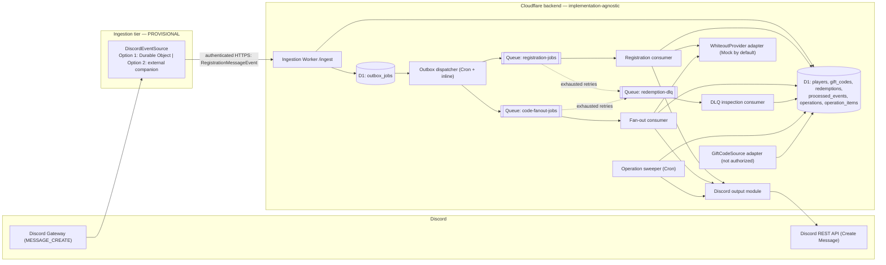
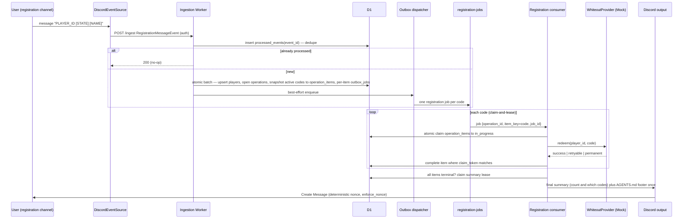

# Architecture — Whiteout Survival Rewards Service

- **Status:** Draft
- **Date:** 2026-08-29
- **Owner:** wos-rewards-service maintainers
- **Supersedes:** none
- **Related:** [ADR 0001 — Discord event ingestion](adr/0001-discord-event-ingestion.md) (**Proposed**), [Whiteout provider decision](whiteout-provider-decision.md)

> Evidence in this document is tagged **[fact:<ref>]** (confirmed by an official
> documentation page listed in [§25](#25-official-sources)), **[inference]** (a design
> conclusion drawn from those facts), or **[assumption]** (needs a spike or human decision).

---

## 1. Scope, goals, non-goals

### In scope

- A Discord bot that registers Whiteout Survival players from plain messages in **one
  configured registration channel** and processes gift codes for them.
- Cloudflare Workers + Durable Objects + D1 + Queues as the backend runtime, TypeScript
  strict mode, staging-first.
- `MockWhiteoutProvider` as the default gift-code redemption provider in development,
  automated tests, and staging.
- A stable ingestion boundary (`DiscordEventSource`) so the rest of the system does not
  depend on how the Discord Gateway connection is hosted.

### Goals

- Idempotent handling of every Discord event, player registration, gift code, and
  redemption attempt.
- Reliable, auditable "operation" aggregation so the two required final Discord summaries
  (post-registration and new-code fan-out) are produced exactly once under concurrency and
  partial failure.
- Clear staging/production separation with no shared secrets, databases, or queues.
- No dependency on undocumented Whiteout Survival endpoints, scraping, cookies, session
  credentials, CAPTCHA bypass, or anti-bot bypass.

### Non-goals

- Production gift-code redemption (blocked — see
  [whiteout-provider-decision.md](whiteout-provider-decision.md)).
- A finalized gift-code discovery source (represented as an abstraction only).
- Discord self-bot behaviour or automation of a normal Discord user account.
- Slash-command / interactions UX as the primary registration path (evaluated only as ADR
  0001 Option 3 / fallback).
- Multi-guild scale-out, a web dashboard, analytics, or historical reporting.
- Choosing where a non-Cloudflare companion process runs (infra decision, deferred).

---

## 2. System context and deployment topology

> **PROVISIONAL — pending [ADR 0001](adr/0001-discord-event-ingestion.md) spike.**
> The ingestion tier below shows **Option 2 (external companion Gateway client)** as the
> provisional reference topology because official platform documentation does **not**
> establish a reliability guarantee for a permanently hosted Cloudflare Gateway client
> **[fact:C1][fact:C2]**. ADR 0001 is **Proposed**; a time-boxed spike decides between
> Option 1 (Durable Object Gateway client) and Option 2. Everything to the right of the
> `DiscordEventSource` boundary is identical for either outcome.



### Deployment stacks

Two fully separate stacks, `staging` and `production`, selected by the `ENVIRONMENT`
variable. Each stack has its own D1 database, its own three Queues, its own Durable Object
namespace (if Option 1 is chosen), its own Discord application + bot token, its own Cron
Triggers, and its own secret set. No resource, name, or secret is shared between stacks.
See [§19](#19-staging-and-production-separation).

### Trust boundaries

- **Discord ↔ ingestion tier:** the Discord bot token authenticates the Gateway
  connection. Only `MESSAGE_CREATE` events for the configured guild + registration channel
  are relevant.
- **Ingestion tier ↔ Cloudflare backend:** the ingestion tier authenticates to the
  Ingestion Worker with `INGESTION_SHARED_SECRET` (Option 2) or is in-process (Option 1).
  The ingestion tier is **untrusted for business logic** — it may not decide whether a
  registration is valid.
- **Cloudflare backend ↔ Whiteout Survival:** all access goes through the
  `WhiteoutProvider` interface. No other component talks to the game.

---

## 3. `DiscordEventSource` — the ingestion boundary

`DiscordEventSource` is the single seam the rest of the system depends on. It delivers one
message shape to the Ingestion Worker and nothing else:

```ts
// The only payload the Cloudflare backend consumes from the ingestion tier.
interface RegistrationMessageEvent {
  event_id: string;    // Discord message id, canonical string (never a number)
  guild_id: string;    // canonical string
  channel_id: string;  // canonical string
  author_id: string;   // canonical string
  content: string;     // RAW message content, forwarded even when syntactically invalid
  created_at: string;  // ISO-8601 timestamp from the Discord message
}

interface DiscordEventSource {
  // Implementations hold the Discord Gateway connection, filter to the configured
  // guild + registration channel, and POST RegistrationMessageEvent to the Ingestion
  // Worker. They perform NO player-registration business validation.
}
```

### Candidate implementations (decided by [ADR 0001](adr/0001-discord-event-ingestion.md))

| | `DurableObjectGatewaySource` (Option 1) | `CompanionGatewaySource` (Option 2, provisional) |
|---|---|---|
| Host | A Durable Object holds the outbound Gateway WebSocket | A minimal always-on process outside Cloudflare |
| Reliability basis | **Not guaranteed by docs** — outbound WebSockets do not hibernate and an active outbound connection only *prevents eviction for up to 15 minutes per connection* **[fact:C2]**; normal lifecycle/eviction timing resumes afterward **[fact:C1]** | A normal long-lived process; standard supervised-restart operations |
| Secrets it holds | Discord bot token (Worker secret) | Discord bot token + `INGESTION_SHARED_SECRET` |
| Decision | The ADR 0001 spike tests whether Option 1 is reliable enough; if it passes, Option 1 is preferred (fewer moving parts) | Provisional reference until the spike completes or is explicitly waived |

**Blocking rule:** the real `DiscordEventSource` adapter (either implementation) is **not
built** until the ADR 0001 spike completes or is explicitly waived. Phases 1–4
([§23](#23-phased-implementation-order)) build everything to the right of this boundary
against `RegistrationMessageEvent` alone.

### Companion validation scope (Option 2)

The companion validates **only**: transport schema of its own forward request, its auth
context (`INGESTION_SHARED_SECRET`), `guild_id`, and `channel_id` (must equal
`DISCORD_REGISTRATION_CHANNEL_ID`). It **forwards `content` verbatim even when the
registration syntax is invalid**, because the Cloudflare business layer must generate the
Discord validation reply **[inference]**. It may drop: non-message events, messages in other
channels/guilds, and the bot's own messages (identity/channel filtering, not business
validation). It has no D1 access and never writes to Discord.

---

## 4. Configuration and environment

Variable **names only** — no values appear in this repository. Values are supplied per
stack via Wrangler vars (non-secret) and Wrangler secrets (secret).

### Non-secret configuration

| Name | Read by | Purpose |
|---|---|---|
| `ENVIRONMENT` | all | `staging` or `production`; selects the stack |
| `DISCORD_REGISTRATION_CHANNEL_ID` | ingestion tier, ingestion Worker | the only channel whose messages are registration commands |
| `DISCORD_GUILD_ID` | ingestion tier, ingestion Worker | expected guild |
| `DISCORD_APPLICATION_ID` | output module, interactions fallback | Discord application id |
| `DEFAULT_STATE` | registration parser | state used when the message omits a numeric state (contract in `AGENTS.md`) |
| `DISCORD_MESSAGE_MAX_LENGTH` | output module | chunking threshold (defaults to the Discord limit) |
| `OPERATION_DEADLINE_SECONDS` | consumers, sweeper | max wall time before an operation is force-closed with a partial summary |
| `ITEM_CLAIM_LEASE_SECONDS` | consumers, sweeper | item claim-and-lease TTL |
| `SUMMARY_CLAIM_LEASE_SECONDS` | consumers, sweeper | final-summary claim lease TTL |
| `FANOUT_EXPANSION_PAGE_SIZE` | fan-out expansion worker | rows per bounded expansion page |
| `OUTBOX_DISPATCH_MAX_ATTEMPTS` | outbox dispatcher | attempts before an outbox row is marked `dead` |
| `CODE_DISCOVERY_ENABLED` | code-discovery scheduler | master switch; `false` until a source is authorized |
| `PRODUCTION_REDEMPTION_ENABLED` | provider adapter | must be `false` unless an authorized provider is documented and approved |
| `PROVIDER_MODE` | provider adapter | `mock` (default) or a named authorized provider |
| `REGISTRATION_JOBS_QUEUE` / `CODE_FANOUT_JOBS_QUEUE` / `REDEMPTION_DLQ_QUEUE` | producers/consumers | queue bindings |
| `PROVIDER_MAX_RETRIES` | consumers | retry cap for retryable provider failures (≤ Queues max, [fact:C8]) |
| `PROVIDER_RATE_LIMIT_PER_SECOND` | provider adapter | client-side rate limiting toward the provider |
| `LOG_LEVEL` | all | structured-log verbosity |

### Secrets (names only — never values, never logged)

| Name | Held by | Purpose |
|---|---|---|
| `DISCORD_BOT_TOKEN` | ingestion tier, output module | Discord bot authentication |
| `DISCORD_PUBLIC_KEY` | interactions fallback only | Ed25519 verification for the `/register` fallback ([ADR 0001](adr/0001-discord-event-ingestion.md) Option 3) |
| `INGESTION_SHARED_SECRET` | companion (Option 2), ingestion Worker | authenticates companion → `/ingest` |

**No production Whiteout provider secret is defined.** A future authorized provider may use
any authentication mechanism; its secret name(s) are added only when its contract is
documented and approved. Any `WHITEOUT_PROVIDER_*` name that appears later is a non-binding
placeholder, not a commitment to API-key authentication.

---

## 5. Discord registration flow

### Channel gate

Only messages in `DISCORD_REGISTRATION_CHANNEL_ID` within `DISCORD_GUILD_ID` are
registration commands **[fact:D2][fact:D3]**. Everything else is ignored by the ingestion
tier.

### Parsing (authoritative rules from `AGENTS.md`)

Supported message forms:

- `PLAYER_ID`
- `PLAYER_ID DISPLAY_NAME`
- `PLAYER_ID STATE`
- `PLAYER_ID STATE DISPLAY_NAME`

Behaviour:

- `PLAYER_ID` is required and must be numeric (validated as `^\d+$`). It is **stored and
  transported as a canonical string** — see [§10](#10-identifier-handling).
- If the second token is numeric, it is `STATE` (also kept as a string).
- If the second token is not numeric, `STATE` is `DEFAULT_STATE` (from environment
  configuration, never hard-coded) and the second and all remaining tokens are
  `DISPLAY_NAME`.
- `DISPLAY_NAME` is optional and may contain spaces.
- If no display name is supplied, Discord output uses `ID <PLAYER_ID>`.
- Re-registering an existing player updates the existing row (upsert), never creates a
  duplicate.
- Display names are sanitized and mentions suppressed on output
  ([§18](#18-discord-output-safety)).
- The bot never infers state or nickname from any Whiteout Survival endpoint.

### Invalid message

If parsing fails, the **Cloudflare business layer** (not the ingestion tier) posts a safe,
mention-suppressed validation message back to the registration channel describing the
accepted forms. The reply is sent through the same leased-send path as summaries
([§15](#15-operation-aggregation-and-final-summary-delivery)) so a retry cannot double-post.
No player row is created.

### Valid message — sequence



If the active-code snapshot is empty, `expected_count = 0` and the operation is immediately
finalisable with a zero-result summary ("0 codes applied"), still carrying the runtime
footer exactly once.

---

## 6. Existing-code processing after registration

1. **Idempotent player upsert** keyed by `player_id`.
2. **Open a `registration_run` operation.** In one atomic D1 batch **[fact:C9]**: write the
   `players` upsert, the `operations` row, one `operation_items` row per code in the
   snapshot `SELECT code FROM gift_codes WHERE status='active'` (taken at commit time), and
   one per-item `outbox_jobs` row. `expected_count` is fixed at the snapshot size.
3. **Dispatch** (`registration-jobs`) — inline best-effort plus the Cron dispatcher
   ([§14](#14-transactional-outbox)).
4. **Consume:** each job carries `{operation_id, item_key: code, job_id}`. The consumer
   **claims the item** ([§15](#15-operation-aggregation-and-final-summary-delivery)) then
   calls `WhiteoutProvider.redeem(player_id, code)`, honouring
   `PROVIDER_RATE_LIMIT_PER_SECOND`, retrying only `retryable` outcomes
   ([§17](#17-retry-and-permanent-failure-classification)), and writes the item result
   conditional on the claim token.
5. **Aggregate & summarize:** when every item is terminal, exactly one consumer claims the
   summary lease and posts the final Discord summary — how many codes were applied and
   which — identifying the player by display name or `ID <PLAYER_ID>`. The runtime footer
   from `AGENTS.md` is appended exactly once. Zero codes ⇒ immediate zero-result summary.

---

## 7. New-code fan-out flow

1. **Discover** a candidate code via `GiftCodeSource` ([§9](#9-component-responsibilities),
   [§11](#11-whiteoutprovider-and-giftcodesource-abstractions)). The source is **not
   authorized** yet; the flow is defined so it works the moment an authorized source exists.
2. **Deduplicate** on `gift_codes.code` (unique). A re-seen code is a no-op.
3. **Open a `code_distribution_run` operation** and fix a **stable player snapshot
   boundary** at discovery time (a monotonic `player_id` cursor filtered by `snapshot_at`,
   or an `operation_players_snapshot` side table). `expected_count` = boundary size.
4. **Bounded, restartable expansion:** the fan-out expansion worker repeatedly reads the
   next `FANOUT_EXPANSION_PAGE_SIZE` players after `expansion_cursor` and, in one atomic D1
   batch, writes that page's `operation_items` rows + per-item `outbox_jobs` rows + the
   advanced `expansion_cursor`. `expansion_state` moves `pending → expanding → expanded`.
   After a crash it resumes from the persisted cursor; already-written pages are skipped by
   primary-key conflict.
5. **Consume** (`code-fanout-jobs`): claim-and-lease each item, then
   `redeem(player_id, code)`, rate-limited, retry only `retryable`.
6. **Aggregate & summarize:** when `expansion_state = expanded` **and** all items are
   terminal, exactly one consumer claims the summary lease and posts the final Discord
   summary containing the code, the successful-player count, and a comma-separated list of
   display names / `ID <PLAYER_ID>` fallbacks. Output is **chunked** when it exceeds
   `DISCORD_MESSAGE_MAX_LENGTH` ([§18](#18-discord-output-safety)); the runtime footer is
   appended exactly once, on the final chunk only. Zero registered players ⇒ immediate
   zero-result summary.

### Non-overlap with registration runs

A `registration_run` snapshots the codes active **at registration time**; a
`code_distribution_run` snapshots the players registered **at discovery time**. A player who
registers after a code is discovered receives that code through their own
`registration_run`. `redemptions` unique on `(player_id, code)` guards any residual overlap
**[inference]**.

---

## 8. Component responsibilities

| Component | Responsibility | Notes |
|---|---|---|
| `DiscordEventSource` | Hold the Gateway connection; filter to guild+channel; POST `RegistrationMessageEvent` | Companion **or** DO, per ADR 0001; no business logic |
| Ingestion Worker (`/ingest`) | Authenticate the source; dedupe on `event_id`; parse; open operations; write the atomic intent + outbox rows; post the validation reply for invalid input | Stateless Worker |
| Fan-out expansion worker | Paginate the player snapshot into `operation_items` + outbox rows | Cursor-driven, bounded, restartable |
| Outbox dispatcher | Enqueue `pending` outbox rows; back off; mark `dead`; terminalise the item on `dead` | Cron (every minute, [fact:C4]) + inline best-effort |
| Registration consumer | Claim item; `redeem` one code; classify; complete under claim token; claim + send summary | Queue consumer |
| Fan-out consumer | Claim item; `redeem` one player; classify; complete under claim token; claim + send summary when expansion done | Queue consumer |
| DLQ inspection consumer | Mark the `operation_items` row `retry_exhausted`; record reason | Consumer of `redemption-dlq` |
| Operation sweeper | Force-close operations past `OPERATION_DEADLINE_SECONDS`; reset expired item leases and summary claims | Cron |
| Discord output module | Build summaries/replies; sanitize; suppress mentions; chunk; leased send with deterministic nonce | Wraps Discord REST Create Message |
| `WhiteoutProvider` adapter | `redeem(playerId, code)` → structured result; provider-side rate limiting; error mapping | `MockWhiteoutProvider` by default |
| `GiftCodeSource` adapter | Discover/list candidate codes from an **authorized** source | Not authorized; disabled |
| Code-discovery scheduler | Poll the authorized source when `CODE_DISCOVERY_ENABLED=true` | Cron; no-op until authorized |
| D1 | System of record | See [§12](#12-preliminary-d1-data-model) |
| Queues + DLQ | Async fan-out + retry isolation | See [§13](#13-cloudflare-queue-and-dead-letter-queue-boundaries) |

---

## 9. Scheduled (Cron) components and the trigger budget

Cloudflare allows **5 Cron Triggers per account on Free, 250 on Paid** **[fact:C5]**, and
minimum granularity is one minute **[fact:C4]**. The design keeps the scheduled surface
small and, where practical, multiplexes work into a single `scheduled()` handler that
dispatches by current UTC minute.

| Scheduled job | Cadence | Work |
|---|---|---|
| Outbox dispatcher | every minute | enqueue `pending` `outbox_jobs`; back off; mark `dead`; terminalise the item on `dead` ([§14](#14-transactional-outbox)) |
| Operation sweeper | every minute | force-close operations past `deadline_at` with a partial summary; reset expired item leases and summary claims; requeue stuck `enqueued` outbox rows ([§15](#15-operation-aggregation-and-final-summary-delivery)) |
| Outbox retention | hourly | delete fully-accounted `enqueued` outbox rows past the retention window |
| Code-discovery scheduler | configurable | poll the authorized `GiftCodeSource` when `CODE_DISCOVERY_ENABLED=true`; **no-op until a source is authorized** |

Durable Object **alarms** ([fact:C3]) are an implementation option for per-operation timers
if Option 1 is chosen or if per-operation precision is needed; they do not consume the Cron
Trigger budget.

---

## 10. Identifier handling

- **`PLAYER_ID`** is validated on input as `^\d+$`, then **stored and transported only as a
  canonical string**: D1 column type `TEXT`, TypeScript type `string`, JSON string in every
  queue payload and interface. It is **never** parsed to a JavaScript `number` and **never**
  stored in a SQLite `INTEGER` column, because large numeric ids lose precision beyond
  2^53 and integer affinity would normalise away leading zeros **[fact:C9]**.
- **`STATE`** is digit-only input but is likewise kept as `TEXT` / `string`; no arithmetic
  is performed on it.
- **Canonicalisation rule (to finalise in implementation):** trim surrounding whitespace;
  reject empty; preserve the remaining digit string verbatim.
- Every key, foreign key, queue payload field, `operation_items.item_key`, and idempotency
  check in this document uses string identifiers.

---

## 11. `WhiteoutProvider` and `GiftCodeSource` abstractions

The two concerns are **separate interfaces**. Discovery never lives on `WhiteoutProvider`.

```ts
type RedeemResult =
  | { outcome: 'success' }
  | { outcome: 'retryable'; reasonCode: string }   // 429 / 5xx / network / provider "rate limited"
  | { outcome: 'permanent'; reasonCode: string };  // invalid code, expired code, ineligible player

interface WhiteoutProvider {
  // Apply ONE gift code to ONE player and map the provider response to RedeemResult.
  redeem(playerId: string, code: string): Promise<RedeemResult>;
}

interface DiscoveredCode {
  code: string;
  source: string;        // identifier of the authorized source
  discoveredAt: string;  // ISO-8601
}

interface GiftCodeSource {
  // Discover/list candidate gift codes from a SEPARATELY AUTHORIZED source.
  // Status: NOT AUTHORIZED. No scraping, no undocumented game endpoint.
  listCandidateCodes(): Promise<DiscoveredCode[]>;
}
```

- The **registration consumer reads active codes from D1** (`gift_codes` where
  `status='active'`), never from `WhiteoutProvider`.
- `MockWhiteoutProvider` is the default in development, automated tests, and staging. It
  produces deterministic, configurable outcomes (`success`, `retryable` for simulated rate
  limits and 5xx, `permanent` for invalid/expired codes) and is idempotent by construction.
- Error mapping is a table owned by the adapter (provider signal → `retryable` / `permanent`
  + `reasonCode`); see [whiteout-provider-decision.md](whiteout-provider-decision.md) §6.
- All Whiteout Survival access goes through `WhiteoutProvider`. Real redemption stays
  disabled until an authorized provider and its API contract are documented and approved.

---

## 12. Preliminary D1 data model

> **Preliminary — no migrations are authored in this task.** Column lists below are a
> design sketch for later implementation. All identifier columns are `TEXT`
> ([§10](#10-identifier-handling)).

### `players`

| Column | Type | Notes |
|---|---|---|
| `player_id` | TEXT PK | canonical digit string |
| `state` | TEXT | digit string; from input or `DEFAULT_STATE` |
| `display_name` | TEXT NULL | rendered as `ID <player_id>` when null |
| `created_at`, `updated_at` | TEXT | ISO-8601 |

Re-registration = upsert on `player_id`.

### `gift_codes`

| Column | Type | Notes |
|---|---|---|
| `code` | TEXT PK | dedupe key |
| `status` | TEXT | `active` / `expired` / `disabled` |
| `discovered_at` | TEXT | |
| `source` | TEXT | authorized-source identifier |
| `first_seen_event_id` | TEXT NULL | provenance |

### `redemptions`

| Column | Type | Notes |
|---|---|---|
| `player_id` | TEXT | PK part |
| `code` | TEXT | PK part |
| `status` | TEXT | `pending` / `success` / `permanent_failure` / `retry_exhausted` |
| `reason_code` | TEXT NULL | |
| `attempts` | INTEGER | |
| `last_attempt_at`, `updated_at` | TEXT | |

PK `(player_id, code)` — the durable, provider-independent "has this player got this code"
record.

### `processed_events`

| Column | Type | Notes |
|---|---|---|
| `event_id` | TEXT PK | Discord message id |
| `kind` | TEXT | `registration` / … |
| `processed_at` | TEXT | |
| `result_summary` | TEXT | short audit string |

### `operations`

| Column | Type | Notes |
|---|---|---|
| `operation_id` | TEXT PK | ULID/UUID |
| `type` | TEXT | `registration_run` / `code_distribution_run` |
| `trigger_kind` | TEXT | `discord_event` / `discovered_code` |
| `trigger_ref` | TEXT | event id or `code` |
| `snapshot_at` | TEXT | boundary timestamp |
| `expected_count` | INTEGER | fixed at snapshot; `0` allowed |
| `expansion_state` | TEXT | `pending` / `expanding` / `expanded` |
| `expansion_cursor` | TEXT NULL | last `player_id` expanded, fixed sort order |
| `state` | TEXT | `pending` / `in_progress` / `awaiting_summary` / `summarized` / `stale_closed` |
| `deadline_at` | TEXT | `snapshot_at + OPERATION_DEADLINE_SECONDS` |
| `summary_state` | TEXT | `none` / `claimed` / `sent` |
| `summary_claim_token` | TEXT NULL | lease token |
| `summary_claim_expires_at` | TEXT NULL | lease expiry |
| `summary_nonce` | TEXT | deterministic, **≤ 25 chars**, derived from `operation_id` **[fact:D6]** |
| `summary_message_id` | TEXT NULL | recorded after Create Message |
| `summary_sent_at` | TEXT NULL | gates re-send |
| `success_count` / `permanent_failure_count` / `retry_exhausted_count` / `completed_count` | INTEGER NULL | **cache only**, recomputed from `operation_items` at summary time |
| `created_at`, `updated_at` | TEXT | |

### `operation_items`

| Column | Type | Notes |
|---|---|---|
| `operation_id` | TEXT | PK part |
| `item_key` | TEXT | PK part — `code` (registration) or `player_id` (distribution) |
| `job_id` | TEXT | `registration:<operation_id>:<code>` / `distribution:<operation_id>:<player_id>` |
| `status` | TEXT | `pending` / `in_progress` / `success` / `permanent_failure` / `retry_exhausted` |
| `claim_token` | TEXT NULL | lease token |
| `claim_expires_at` | TEXT NULL | lease expiry |
| `reason_code` | TEXT NULL | |
| `attempts` | INTEGER | |
| `updated_at` | TEXT | |

PK `(operation_id, item_key)`.

### `operation_players_snapshot` (distribution runs only; optional)

| Column | Type | Notes |
|---|---|---|
| `operation_id` | TEXT | PK part |
| `player_id` | TEXT | PK part |

Point-in-time player boundary when a monotonic cursor filter is not used.

### `outbox_jobs`

| Column | Type | Notes |
|---|---|---|
| `job_id` | TEXT PK | per-item deterministic id (see `operation_items.job_id`) |
| `operation_id` | TEXT | |
| `item_key` | TEXT | |
| `type` | TEXT | `registration` / `distribution` |
| `payload_json` | TEXT | the queue message body |
| `status` | TEXT | `pending` / `enqueued` / `dead` |
| `attempts` | INTEGER | |
| `available_at` | TEXT | backoff gate |
| `last_error` | TEXT NULL | |
| `created_at`, `updated_at` | TEXT | |

---

## 13. Cloudflare Queue and dead-letter-queue boundaries

- **Queues:** `registration-jobs`, `code-fanout-jobs`. One message per unit of work,
  carrying `{operation_id, item_key, job_id, ...}` in the body. Cloudflare Queues exposes
  **no producer-side idempotency key** — deduplication is entirely consumer-side
  **[fact:C7]**. Delivery is at-least-once, so consumers must be safely re-runnable.
- **Batching / limits:** batch size ≤ 100 messages / 256 KB, batch wait ≤ 60 s, message
  ≤ 128 KB, `delaySeconds` ≤ 24 h, `max_retries` up to 100 **[fact:C8]**. Retry classified
  failures with `message.retry({ delaySeconds })` and backoff up to `PROVIDER_MAX_RETRIES`.
- **DLQ:** `redemption-dlq` receives a message only after its consumer exhausts
  `max_retries` **[fact:C6]**. It has its own inspection consumer that marks the matching
  `operation_items` row `retry_exhausted` with a reason, so the operation can still
  finalise. **Business-rule (`permanent`) failures never enter the DLQ** — they are
  recorded as terminal item results directly.

---

## 14. Transactional outbox

**Decision:** a per-item transactional outbox bridges the gap between a committed D1 intent
and a Queue enqueue. This design is **intended to prevent loss between the committed D1
intent and eventual Queue enqueue, subject to the documented platform guarantees and the
recovery process below** — it is not an absolute "no loss" claim.

- **Atomic write:** each page of domain rows is written together with its per-item
  `outbox_jobs` rows in a single `db.batch()` (atomic, all-or-nothing) **[fact:C9]**. Large
  fan-out is written a bounded page at a time
  ([§7](#7-new-code-fan-out-flow)), never one unbounded batch.
- **Identity:** `job_id` is per unit of work
  (`registration:<operation_id>:<code>` / `distribution:<operation_id>:<player_id>`) and is
  carried in the queue message body alongside `operation_id` and `item_key`. The **consumer**
  uses it as the application-level dedup key (no producer key exists, [fact:C7]).
- **Dispatch:** (a) inline best-effort `queue.send()` immediately after a page commits,
  marking sent rows `enqueued`; (b) authoritative Cron dispatcher (every minute,
  [fact:C4]) scanning `status='pending' AND available_at <= now`, enqueuing, marking
  `enqueued`, and on failure setting `available_at` with exponential backoff and
  incrementing `attempts`. After `OUTBOX_DISPATCH_MAX_ATTEMPTS` the row is marked `dead` and
  an alert is raised.
- **`dead` before successful enqueue:** the dispatcher terminalises the related
  `operation_items` row as `retry_exhausted` (reason `outbox_dead`) so the operation's
  completion accounting is never left waiting for a job that will never enqueue.
  Documented operator recovery: fix the cause, re-queue the `dead` row; the item stays
  `retry_exhausted` until then and the operation can still finalise.
- **Recovery:** on restart the dispatcher simply re-scans `pending`. The operation sweeper
  resets rows stuck in `enqueued` with no downstream progress past a threshold back to
  `pending`. A retention job deletes fully-accounted `enqueued` rows after a fixed period.

---

## 15. Operation aggregation and final-summary delivery

### Snapshot and expected count

`expected_count` is captured from a defined, stable snapshot boundary
([§6](#6-existing-code-processing-after-registration),
[§7](#7-new-code-fan-out-flow)) and never changes. `expected_count = 0` is valid and makes
the operation immediately finalisable ([zero-item operations](#zero-item-operations)).

### Item claim-and-lease (before any provider call)

A terminal-state check alone does not stop two concurrent deliveries from both calling the
provider **[inference]**, so each item carries a lease:

- **States:** `pending` → `in_progress` (`claim_token`, `claim_expires_at`) → `success` |
  `permanent_failure` | `retry_exhausted`.
- **Atomic claim:**
  ```sql
  UPDATE operation_items
     SET status = 'in_progress', claim_token = :tok, claim_expires_at = :exp, updated_at = :now
   WHERE operation_id = :op AND item_key = :key
     AND (status = 'pending' OR (status = 'in_progress' AND claim_expires_at < :now));
  ```
  The consumer proceeds only if one row changed. A redelivery that finds the item already
  terminal, or `in_progress` with a live lease, is acked as a no-op.
- **Token-conditional completion:**
  ```sql
  UPDATE operation_items
     SET status = :result, reason_code = :rc, attempts = attempts + 1, updated_at = :now
   WHERE operation_id = :op AND item_key = :key AND claim_token = :tok;
  ```
  A worker whose lease expired and was stolen cannot overwrite the new claimant's result.
- **Lease recovery:** a crashed worker's item becomes re-claimable once `claim_expires_at`
  passes; the sweeper also resets long-expired `in_progress` items.
- **Unavoidable ambiguity:** if a *real* provider performs the redemption but the Worker
  crashes before the token-conditional write, the retry may call the provider again. This is
  why a production `WhiteoutProvider` **must** support a stable redemption idempotency key or
  an authorized lookup/reconciliation mechanism
  ([whiteout-provider-decision.md](whiteout-provider-decision.md) §5). `MockWhiteoutProvider`
  is idempotent by construction.

### Completion accounting

Counts are **derived on demand** from `operation_items`
(`SELECT status, COUNT(*) ... GROUP BY status`) as the source of truth; any counter columns
on `operations` are a recomputed cache. An operation is finalisable when
`count(status IN ('success','permanent_failure','retry_exhausted')) >= expected_count`
(and, for distribution runs, `expansion_state = 'expanded'`).

### Leased final-summary claim

- Guarded claim:
  ```sql
  UPDATE operations
     SET summary_state = 'claimed', summary_claim_token = :tok,
         summary_claim_expires_at = :exp, state = 'awaiting_summary', updated_at = :now
   WHERE operation_id = :op
     AND (summary_state = 'none'
          OR (summary_state = 'claimed' AND summary_claim_expires_at < :now));
  ```
  Proceed only if one row changed.
- The claimant builds the summary, sends it, then:
  ```sql
  UPDATE operations
     SET summary_state = 'sent', summary_message_id = :mid, summary_sent_at = :now
   WHERE operation_id = :op AND summary_claim_token = :tok;
  ```
- **Recovery does not let an expired claimant and a new claimant send unmitigated:** both
  use the **same deterministic `summary_nonce` (≤ 25 chars, derived from `operation_id`)**
  with `enforce_nonce = true`. Discord checks nonce uniqueness only within the past few
  minutes and, for a repeat by the same author in that window, **returns the existing
  message instead of creating another** **[fact:D6]**. `summary_sent_at` then blocks further
  attempts.
- **Real delivery guarantee: at-least-once summary delivery with bounded (few-minute)
  duplicate suppression — not exactly-once.** The same deterministic-nonce technique is
  applied to the invalid-registration validation reply ([§5](#5-discord-registration-flow)).

### Zero-item operations

If a `registration_run` snapshot has **zero active codes**, or a `code_distribution_run`
snapshot has **zero registered players**, `expected_count = 0` and the operation is
**immediately eligible for its final summary** (a zero-result summary: "0 codes applied" /
"applied to 0 players"). The runtime footer from `AGENTS.md` is still appended **exactly
once**.

### Scenario matrix

| Scenario | Handling |
|---|---|
| All items terminal | Claim summary lease → send → `state = 'summarized'` |
| An item reaches the DLQ | DLQ consumer marks the item `retry_exhausted` (reason recorded); counts toward the terminal total; summary reports it as a failure |
| An `outbox_jobs` row goes `dead` before enqueue | Dispatcher terminalises the item as `retry_exhausted` (reason `outbox_dead`); same accounting |
| Operation misses `deadline_at` | Sweeper → `state = 'stale_closed'` + a **partial** summary (success / permanent-failure / retry-exhausted / still-pending counts, labelled partial), footer once; late results update items for audit only, no second summary |
| Discord accepts the summary but the Worker crashes before recording `summary_message_id` | The leased claim is retried (same claimant while the lease holds, or a fresh claimant after expiry); the retry re-calls Create Message with the same nonce + `enforce_nonce`. Inside the window Discord returns the existing message; outside it a second summary is possible — documented residual risk, mitigated by a short sweeper threshold and self-consistent summary text |

---

## 16. Idempotency

| Layer | Key | Mechanism |
|---|---|---|
| Discord event | `processed_events.event_id` | insert-or-ignore before any work |
| Player | `players.player_id` | upsert |
| Gift code | `gift_codes.code` | unique |
| Redemption | `redemptions (player_id, code)` | unique; durable provider-independent record |
| Operation item | `operation_items (operation_id, item_key)` | PK + **claim-and-lease** ([§15](#15-operation-aggregation-and-final-summary-delivery)) |
| Outbox → Queue | `outbox_jobs.job_id` in the message body | **consumer-side** dedup (no producer key, [fact:C7]) |
| Final summary / validation reply | `operations.summary_nonce` + `enforce_nonce` | bounded duplicate suppression ([fact:D6]) |

Queues are at-least-once **[fact:C7][fact:C8]**; every consumer is written to be safely
re-runnable.

---

## 17. Retry and permanent-failure classification

| Provider / transport signal | Class | Action |
|---|---|---|
| HTTP 429, `Retry-After` present | `retryable` | `message.retry({ delaySeconds })`, honour `Retry-After`, exponential backoff |
| HTTP 5xx, connection reset, timeout | `retryable` | retry with backoff up to `PROVIDER_MAX_RETRIES` |
| Provider "rate limited" / "temporarily unavailable" | `retryable` | retry with backoff |
| Invalid code, expired code, code disabled | `permanent` | record terminal `permanent_failure`, no retry, **never DLQ** |
| Player ineligible / unknown to the game | `permanent` | record terminal `permanent_failure` |
| Input validation failure (bad `PLAYER_ID`) | `permanent` | never reaches a queue; validation reply instead |
| Retries exhausted | `retry_exhausted` | message → `redemption-dlq` → item marked `retry_exhausted` |

Backoff, `delaySeconds`, and `PROVIDER_MAX_RETRIES` stay within Queue limits **[fact:C8]**.

---

## 18. Discord output safety

- **Sanitisation:** display names and any echoed user input are sanitized before rendering
  (strip/escape backticks, `@`, `#`, `:` role/emoji triggers, zero-width and control
  characters; cap length).
- **Mention suppression:** every Create Message call sets `allowed_mentions` to an empty
  allow-list so `@everyone`, role, and user mentions never fire.
- **No silent mutation:** the service never edits or deletes a message it did not just
  create; summaries are new messages only.
- **Chunking:** when a summary exceeds `DISCORD_MESSAGE_MAX_LENGTH`, split on line
  boundaries (never mid-name), hard-cap each chunk below the limit, add
  `(part N/M)` continuation markers, and append the `AGENTS.md` runtime footer **exactly
  once, on the final chunk only**.
- **Footer scope:** the runtime footer defined in `AGENTS.md` is appended only to final
  runtime Discord operation summaries emitted after gift-code processing. It is never added
  to validation replies, logs, docs, commit messages, or PR descriptions. (This document
  deliberately does not reproduce the footer string; the authoritative text lives in
  `AGENTS.md`.)

---

## 19. Staging and production separation

| Resource | Separation |
|---|---|
| D1 database | distinct database per stack; distinct binding name |
| Queues (`registration-jobs`, `code-fanout-jobs`, `redemption-dlq`) | distinct queues per stack |
| Durable Object namespace (Option 1) | distinct namespace per stack |
| Discord application + bot token | distinct app and `DISCORD_BOT_TOKEN` per stack |
| Cron Triggers | defined per stack; **≤ 5 per account on Free, ≤ 250 on Paid** [fact:C5] |
| Secrets | never shared; set per stack via Wrangler secrets |
| `PRODUCTION_REDEMPTION_ENABLED` | `false` in staging always; `false` in production until an authorized provider is approved |

Migrations are applied to staging first, then production, after review.

---

## 20. Observability without leaking secrets

- **Structured logs** with an explicit field allow-list: `environment`, `operation_id`,
  `operation_type`, `item_key`, `event_id` (correlation id), `status`, `reason_code`,
  `attempts`, `queue`, timings. **Never logged:** `DISCORD_BOT_TOKEN`,
  `INGESTION_SHARED_SECRET`, any future provider secret, raw message `content` beyond a
  truncated/sanitized preview needed for a validation-failure log, provider response bodies
  beyond mapped `reasonCode`s.
- **Redaction helper** applied at the log boundary; unit-tested.
- **Metrics:** events processed; redemptions by outcome (`success` / `retryable` /
  `permanent` / `retry_exhausted`); operations by `state`; operations `awaiting_summary`;
  operations `stale_closed`; DLQ depth; queue backlog; outbox backlog and `dead` count;
  Gateway reconnect / RESUME / IDENTIFY counts (ingestion tier).
- **Alerts:** DLQ depth > 0, outbox `dead` count > 0, operations `stale_closed` rate,
  ingestion tier disconnected, IDENTIFY budget pressure.

---

## 21. Testing strategy

- **Mandated unit tests (`AGENTS.md`):** input validation; deduplication; retry
  classification; message chunking; provider error mapping.
- **Additional unit tests:** registration parser table (all four forms, numeric-vs-name
  second token, spaces in names, `DEFAULT_STATE` fallback, `ID <PLAYER_ID>` fallback);
  string-identifier round-trips (no precision loss, leading zeros preserved); idempotency
  (`processed_events`, `redemptions`, `operation_items`); claim-and-lease concurrency
  (two workers, one winner; expired-lease steal; token-conditional completion);
  single-summary claim under concurrency; zero-item operation finalisation;
  bounded-expansion resume from cursor; footer-exactly-once (including chunked output and
  partial summaries).
- **Provider:** `MockWhiteoutProvider` in every automated test and in staging.
- **Runtime:** tests run under a Workers-compatible test runner; integration tests where
  available (local D1, local Queues).
- **Pre-finish gate:** run formatting, type checking, unit tests, and available integration
  tests. (At the time this document is authored the repository has no build yet; only
  Markdown checks apply — see [§24](#24-unresolved-decisions-and-risks).)

---

## 22. Failure modes and recovery

| Failure | Effect | Recovery |
|---|---|---|
| `DiscordEventSource` down (Option 2 companion, or Option 1 DO not resident) | Live `MESSAGE_CREATE` events missed while down | Supervised restart; on reconnect, Discord replays only within session/Resume limits [fact:D1]; missed events need bounded REST catch-up or manual re-send ([§24](#24-unresolved-decisions-and-risks)) |
| Gateway Resume fails (Invalid Session `d=false`) | Fresh IDENTIFY required | Reconnect + IDENTIFY; watch the 1000/24 h IDENTIFY budget [fact:D1] |
| Ingestion Worker `/ingest` unavailable | Companion cannot forward | Companion retries with bounded local buffer; `event_id` dedup makes re-sends safe |
| D1 unavailable | Intent cannot commit | Ingestion returns 5xx; companion retries; nothing enqueued without a committed intent |
| Queue backlog | Delayed redemptions | Consumers scale (push concurrency up to 250, [fact:C8]); operations bounded by `deadline_at` |
| Provider outage / rate-limit storm | Many `retryable` failures | Backoff + `PROVIDER_RATE_LIMIT_PER_SECOND`; retries exhaust → DLQ → `retry_exhausted`; summary reports failures |
| DLQ growth | Redemptions stuck | Alert; DLQ inspection consumer terminalises items; operator triage |
| Duplicate queue delivery | Repeated processing attempt | Absorbed by claim-and-lease + token-conditional completion |
| Partial fan-out (crash mid-expansion) | Some `operation_items` missing | Expansion worker resumes from `expansion_cursor`; finalisation waits for `expanded` |
| Summary send crash after Discord accept | Possible duplicate summary outside the nonce window | Deterministic nonce + `enforce_nonce` suppress within the window; `summary_sent_at` gates further attempts |
| Outbox row `dead` | One unit of work will never enqueue | Item terminalised `retry_exhausted` (`outbox_dead`); operation still finalises; operator may re-queue |

---

## 23. Phased implementation order

Each phase is its own branch + PR, starting from the merged `main`. No merge or deploy is
automated.

1. **Scaffold** — TypeScript strict, Wrangler config for the `staging` stack,
   `MockWhiteoutProvider`, test harness. Staging only.
2. **D1 schema + migrations** for the preliminary model ([§12](#12-preliminary-d1-data-model)).
3. **Ingestion Worker + `DiscordEventSource` interface + transactional outbox + Queues** —
   no real Gateway adapter yet; drive `/ingest` with synthetic `RegistrationMessageEvent`s.
4. **Registration + fan-out consumers + operation aggregation + Discord output module** —
   claim-and-lease, leased summary, chunking, footer, zero-item handling, bounded expansion.
5. **ADR 0001 spike** — decide Option 1 vs Option 2 against the spike's pass/fail criteria.
6. **Chosen `DiscordEventSource` adapter** — implement the winner. *(Blocked until phase 5
   completes or is explicitly waived.)*
7. **Observability, sweepers, DLQ consumer, hardening.**
8. **Blocked** — authorized `WhiteoutProvider` / `GiftCodeSource`; production redemption.
   Requires the authorizations in
   [whiteout-provider-decision.md](whiteout-provider-decision.md).

---

## 24. Unresolved decisions and risks

### Resolved

- **Ingestion outcome framing:** spike Option 1 first, then decide. ADR 0001 stays
  **Proposed**; Option 2 is the provisional reference topology; Option 1 is not rejected;
  the real adapter is blocked until the spike completes or is explicitly waived.
- **Slash commands:** documented only in ADR 0001 (Option 3 / fallback), not as a secondary
  path here.
- **D1 → Queue reliability:** per-item transactional outbox (this document, [§14](#14-transactional-outbox)).
- **`nonce` / `enforce_nonce`:** confirmed — `nonce` ≤ 25 chars; `enforce_nonce` checks
  uniqueness within the past few minutes and returns the existing message for a same-author
  repeat **[fact:D6]**.

### Open

- Whether a permanently hosted Cloudflare Gateway client (Option 1) is reliable enough —
  the ADR 0001 spike decides.
- Where the companion runs if Option 2 stands (infra decision).
- `player_id` canonicalisation edge cases (max length; whether to reject leading zeros or
  preserve them — current lean: preserve verbatim).
- Lease durations (`ITEM_CLAIM_LEASE_SECONDS`, `SUMMARY_CLAIM_LEASE_SECONDS`) and
  `FANOUT_EXPANSION_PAGE_SIZE` values — tuning during implementation.
- Missed-event backfill: bounded REST catch-up vs manual re-send only.
- The gift-code discovery source and its contract — not authorized.

### Risks

- Privileged `MESSAGE_CONTENT` intent could gate future scaling (approval needed above
  ~100 guilds / 10,000 users) **[fact:D3]**; mitigation: stay small or plan verification
  early.
- If Option 2 stands, the companion is a single point of failure for live ingestion;
  mitigation: supervised restart, health checks, alerting, `event_id` idempotency so
  re-sends are safe.
- Cloudflare hibernation/eviction timings (~10 s / ~70–140 s idle; 15-minute cap on how
  long an active outbound connection *prevents* eviction) are documented but operational
  **[fact:C1][fact:C2]**; the spike must observe actual behaviour and must not be read as a
  platform guarantee.
- Discord documents no exactly-once message creation; duplicate summaries or validation
  replies are possible outside the few-minute `enforce_nonce` window **[fact:D6]** —
  mitigated, not eliminated.
- At-least-once delivery with no producer dedup key **[fact:C7]** ⇒ duplicate work unless
  claim-and-lease and token-conditional completion are implemented exactly.
- A real provider that redeems but whose Worker crashes before the completion write can
  double-apply a code — hence the production-provider idempotency-key / reconciliation
  requirement; until met, production redemption stays blocked.
- An `outbox_jobs` row reaching `dead` must terminalise its item, or an operation could
  wait past its deadline — handled; flagged as a path to test.
- The gift-code source remaining unauthorized blocks any real end-to-end; staging stays on
  the mock provider indefinitely.

---

## 25. Official sources

Every fact tag above resolves here. All URLs are official
(`docs.discord.com/developers/*`, `developers.cloudflare.com/*`).

| Ref | URL | Facts used |
|---|---|---|
| D1 | <https://docs.discord.com/developers/events/gateway> | Connection lifecycle; Hello + `heartbeat_interval`; jittered first heartbeat; Heartbeat ACK, missed ACK → close with a non-`1000`/`1001` code then reconnect + Resume; Identify required, **1000 IDENTIFY / 24 h** globally (RESUME excluded); Resume needs `session_id` + `resume_gateway_url` + last `s`, no re-Identify; resumable vs non-resumable close codes; Invalid Session (`d` true/false); `1000`/`1001` invalidate the session; **120 gateway events / 60 s → immediate disconnect**; `max_concurrency` bounds IDENTIFY |
| D2 | <https://docs.discord.com/developers/events/gateway-events> | `MESSAGE_CREATE` "Sent when a message is created"; payload = message object + `guild_id?`, `member?`, `mentions`, `channel_type?` |
| D3 | <https://docs.discord.com/developers/topics/gateway> | `MESSAGE_CONTENT (1 << 15)` is a **privileged intent** gating `content`, `embeds`, `attachments`, `components`, `poll`; empty without it except own messages / DMs / mentions / message-context-menu targets; must be enabled in the Developer Portal; < 10,000 users self-enable, verified apps in 100+ guilds need approval; misconfiguration → close `4014` |
| D4 | <https://docs.discord.com/developers/topics/gateway#get-gateway-bot> | Get Gateway Bot returns `url`, `shards`, `session_start_limit` (`total`, `remaining`, `reset_after`, `max_concurrency`); "should not be cached for extended periods" |
| D5 | <https://docs.discord.com/developers/interactions/receiving-and-responding> | Gateway vs HTTP-webhook interactions are mutually exclusive; webhook must verify Ed25519 (`X-Signature-Ed25519` / `X-Signature-Timestamp`); initial response within **3 seconds**; 15-minute follow-up token; deferred types 5 / 6 |
| D6 | <https://docs.discord.com/developers/resources/message#create-message> | Create Message `nonce` is **at most 25 characters**; with `enforce_nonce=true` Discord checks nonce uniqueness **only within the past few minutes**, and for a same-author repeat in that window **returns the existing message instead of creating another**; no strict exactly-once message-creation guarantee |
| C1 | <https://developers.cloudflare.com/durable-objects/concepts/durable-object-lifecycle/> | Stub creation ≠ instantiation; first call runs `constructor()`; **hibernation** after ~10 s idle only with no timers / in-progress `fetch()` / WebSocket API / active connections; **full eviction** ~70–140 s from the non-hibernatable idle state; eviction deferred until all outbound connections close **and** the 70–140 s window elapses; hibernation discards in-memory state; next request re-runs `constructor()` |
| C2 | <https://developers.cloudflare.com/durable-objects/best-practices/websockets/> | "Hibernation is only supported when a Durable Object acts as a WebSocket server. Outgoing WebSockets do not hibernate." "an active outbound WebSocket connection keeps the Durable Object alive and prevents eviction for up to 15 minutes per connection." (A cap on how long an active outbound connection *prevents* eviction — not a statement that the connection is closed or the object evicted at 15 minutes.) Serialized attachment max 16,384 bytes |
| C3 | <https://developers.cloudflare.com/durable-objects/api/alarms/> | One alarm per DO; **guaranteed at-least-once** execution; retried on throw with exponential backoff from 2 s, up to 6 retries; alarms persist across restarts; `constructor()` runs before `alarm()` |
| C4 | <https://developers.cloudflare.com/workers/configuration/cron-triggers/> | `triggers.crons`; `scheduled()` handler; **UTC**; minimum granularity every minute; config propagation up to ~15 min |
| C5 | <https://developers.cloudflare.com/workers/platform/limits/> | Cron Triggers **5 per account (Free) / 250 (Paid)**; Cron CPU 30 s (< 1 h interval) / 15 min (≥ 1 h), Paid; alarm handler max wall time 15 min |
| C6 | <https://developers.cloudflare.com/queues/configuration/dead-letter-queues/> | DLQ receives messages after `max_retries` is reached; default retries before DLQ = 3; DLQ messages with no consumer persist 4 days |
| C7 | <https://developers.cloudflare.com/queues/configuration/javascript-apis/> | `MessageBatch`; `ack()` / `ackAll()`; `retry({ delaySeconds })` / `retryAll(...)`; best-effort ordering; producer API carries `body` + `contentType` only — **no producer-side idempotency / dedup key**; at-least-once delivery |
| C8 | <https://developers.cloudflare.com/queues/platform/limits/> | Message ≤ 128 KB; **max retries 100**; consumer batch ≤ 100 messages / 256 KB; batch wait ≤ 60 s; `delaySeconds` ≤ 24 h; push consumer concurrency up to 250; consumer wall clock 15 min |
| C9 | <https://developers.cloudflare.com/d1/worker-api/d1-database/> | D1 is SQLite; `db.batch([...])` executes statements atomically in a single transaction; integer affinity / JS `number` lose precision beyond 2^53 — identifier columns should be `TEXT` |
